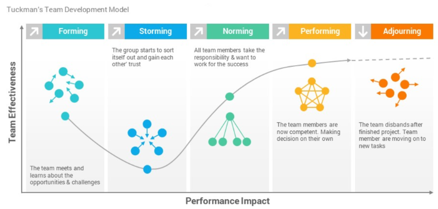
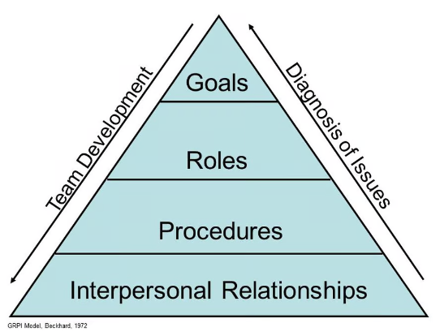
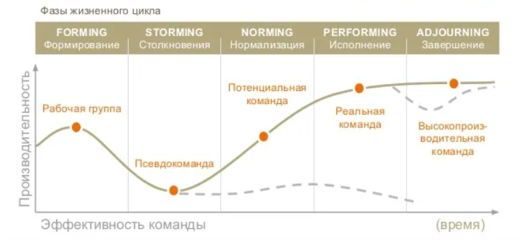
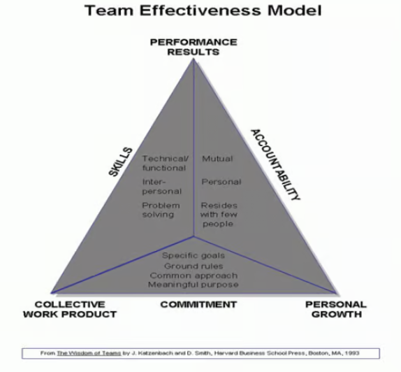
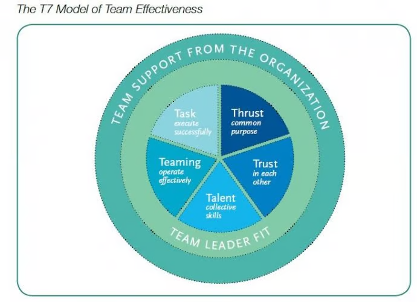
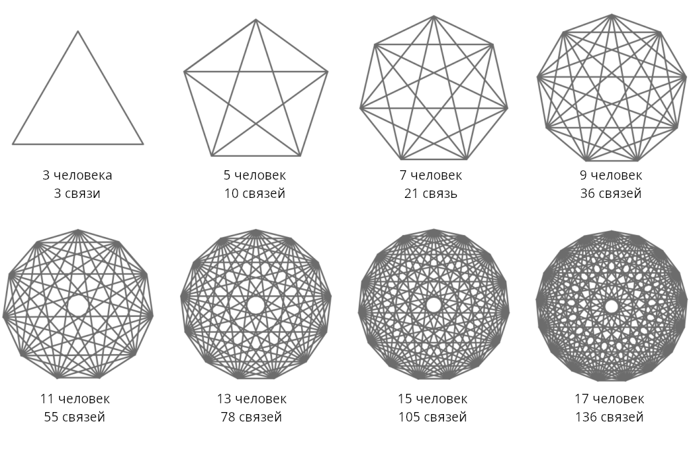

# Глава 1. Что такое команда

## История вопроса

Вопрос формирования команд, конечно, не новый. Много кто им задавался и пытался найти ответы. Понимание сущности команд со временем эволюционировало, как и взгляды на то, что такое организация, как она устроена и как ею управлять.

Западная бизнес-мысль, на которую оказали сильнейшее влияние идеи Адама Смита и Генри Форда о разделении труда и механистический подход, только к середине XX века окончательно признала важность человеческого фактора и обозначила существование феномена «сплоченных рабочих групп».

Не претендую на исчерпывающий обзор, но пройтись по основным вехам развития представлений о команде, думаю, стоит. Если хотите поскорее перейти к сути, можете этот раздел [пропустить](#определение).

Пожалуй, первым существенным шагом можно назвать эксперименты в Хоторне. В ходе исследований на Хоторнском заводе в штате Иллинойс, которые продолжались 12 лет (1924-1936), был выявлен феномен неформальной группы в производственном процессе, отношения между членами которой оказывали существенное влияние на производительность труда. В частности, было выявлено, что группе присуще стремление вырабатывать свои собственные внутригрупповые нормы, ценности и позиции, устанавливать контроль за поведением членов группы в процессе труда.

В 30-е годы XX века свое развитие получила школа человеческих отношений (Мери Паркер Фоллет, Элтон Мэйо, Абрахам Маслоу), чему в немалой степени способствовали результаты хортонских экспериментов. По Мэйо, фактор сотрудничества в группе является обстоятельством, по своей значимости сопоставимым с менеджментом, и может оказаться выше по сравнению с факторами материального стимулирования [1]. Это положение теории Мэйо является чрезвычайно важным при рассмотрении теории и практики рабочих команд, где группа из неформальной переходит в категорию формальной структурной единицы организации.

В 40-х годах активно начинают работать группы исследователей под руководством Эрика Триста и Курта Левина, которых многие авторы считают основоположниками теории рабочих команд [2]. Так, несомненно, можно заметить влияние теории “Z”, предложенной Левиным и в дальнейшем развитой Лундстедтем (анархический стиль типа “laissez-faire”) на практическое внедрение рабочих команд в фирме IBM [3].

В конце 40-х годов появились группы рабочих, которых по ряду признаков можно было отнести к современному понятию команды. Так, в Южном Йоркшире на шахте в 1949 году была создана первая самоуправляемая рабочая команда [4].

В конце 50-х - начале 60-х годов многие развитые западные страны столкнулись с проблемой, потребовавшей нового взгляда на менеджмент. Развитие производительных сил резко подняло уровень образования рабочих и служащих, и как следствие этого денежные стимулы перестали играть ключевую роль в поддержании высокого уровня производительности труда. Люди хотели не просто работать, но и получать удовлетворение от работы. Поэтому можно с уверенностью сказать, что в 60-х годах ХХ века произошел переворот в сознании людей, который определил появление многих новых разработок в теории менеджмента.

В 1965 году американский психолог и исследователь групповой динамики Брюс Такман описал 4 стадии, которые проходят команды, которые впоследствии оказываются эффективны: forming (формирование), storming («перемешивание»), norming (нормирование), performing (функционирование) [5].

Команда сначала формируется и отделяется от внешнего мира, люди знакомятся между собой, затем происходит «буря в стакане» (“storming”), в результате которой команда перемешивается, выстраивается, определяет внутренние нормы и правила поведения и взаимодействия, а члены команды взаимно подстраиваются (“norming”). И только после этого начинается собственно эффективное функционирование команды как единого целого (“performing”).

Дальнейшее развитие модели, предложенное самим Брюсом Такманом и его последователями, добавило новые стадии, учло вариант, когда команда не распадается после выполнения проекта, а приступает к новому. Принципиально модель не изменилась, оставшись интересным наблюдением и интерпретациями, эффективность которых так и не была подтверждена формальным экспериментом, но на тот момент она всех устраивала, да и сейчас нередко на нее ссылаются из-за ее наглядности.

Тем временем набирала обороты отрасль разработки программного обеспечения, и она столкнулась с новыми вызовами и проблемами. В 1964 компании IBM анонсировала операционную систему OS/360 для своих новых суперкомпьютеров, но разработка продвигалась очень тяжело из-за очень высокой сложности и просчетов в проектировании. Кроме того, бумажная документация проекта была очень объемной: только ежедневные исправления насчитывали около 150 страниц текста, и поддержка рабочей тетради проекта стала занимать значительную часть ежедневного рабочего времени. В результате система была выпущена с существенной задержкой, стоимость разработки в несколько раз превысила запланированную, и не соответствовала техническим требованиям.

Анализируя свой опыт, руководитель проекта Фредерик Брукс написал ставшую классической книгу "Мифический человеко-месяц" (1975) [6], в которой обратил внимание, что производительность группы людей может зависеть от ее численности нелинейно. Т.е. нельзя повысить производительность группы просто увеличив ее численность. Наоборот, добавление людей в отстающий от графика проект сделает проект еще более отстающим. И чем сложнее проект, чем больше в нем внутренних логических взаимосвязей, тем выше издержки на взаимодействие между людьми.

В 70-х еще не было ответа, как быть, если необходимо сделать сложный объемный программный продукт, требующий большого количества "человеко-часов". В своей книге Брукс только сформулировал  проблему крупных программных проектов: "серебряной пули нет" (т.е. нет 100% работающего решения). 

Но в нашем контексте, он озвучил ценное предположение, что выходом может стать создание небольших команд, похожих на операционные бригады врачей, в каждой из которых будут свои высококлассные узкие специалисты. Если каждая бригада будет заниматься своей зоной ответственности, то это может сильно снизить трудозатраты на коммуникации. Кроме того, очень важным является осознание нелинейности, т.е. эффективность группы людей зависит от их количества нелинейно, и на нее влияют такие факторы как сложность задачи и структура коммуникаций.

Классическая производственная модель, которая хорошо подходила для создания продуктов “в металле”, в сфере разработки ПО оказалась нежизнеспособной  —  слишком эфемерен и изменчив продукт. И Фредерик Брукс одним из первых это подметил. Таким образом, начало приходить понимание, что для перехода в новый технологический уклад необходимо выработать новые подходы к взаимодействию.

Тем временем в 1972 году была предложена Ричардом Бекхардом и позже популяризирована Ирвином Рубином, Марком Пловником и Рональдом Фраем модель эффективности команды GRPI [7].

В графической форме ее представляют в виде пирамиды. Чтобы команда была эффективной, нужны четыре составляющие:

1. Цели: ясно очерченные цели и желаемые результаты, а также четко заданные приоритеты и ожидания.
2. Роли: четко очерченный круг обязанностей, принятие лидера группой.
3. Процессы: прозрачные процессы принятия решений и рабочие процедуры.
4. Межличностные отношения: успешное взаимодействие, доверие и гибкость.

Модель GRPI предлагается использовать как для создания новых команд, так и для аудита и развития существующих. Ну, допустим.

Следующая веха  —  работа Реймонда Белбина (1975 - 1981) [8], в рамках которой был применен, по сути, эволюционный алгоритм (вероятно, он вдохновился книгой Джона Холланда «Адаптация в естественных и искусственных системах» 1975 года). Эксперимент Бэлбина заключался в том, что он формировал команды из студентов Колледжа менеджмента Хенли и организовывал соревнование между ними по решению различных задач. Затем отбирал сильнейшие команды, переформировывал те, которые оказались слабее, и повторял соревнование снова. Параллельно он исследовал то, как люди общаются в процессе решения поставленных задач и на основе полученных результатов выделил 9 (первоначально 8) ролей, наличие которых в команде способствует достижению наиболее высоких результатов: «душа команды», «координатор» (или «председатель»), «генератор идей», «собиратель идей» (или «исследователь ресурсов»), «стратег-аналитик», «шейпер» (или «контролер»), «специалист» и «реализатор».

Данную модель пытаются применять и сейчас, и она известна как модель Белбина. Но на мой взгляд, интереснее то, что результатом работы стал также вывод, что наиболее эффективными являются команды численностью 4-5 человек. К вопросу, почему это так, мы еще вернемся  —  теперь этому есть научное обоснование. 

Книга Тома Демарко и Тимоти Листера “Человеческий фактор. Успешные проекты и команды” [9], вышедшая в 1987 году, стала сборником тех ошибок, которые совершают корпорации, пытаясь по своему разумению организовать труд людей. В исходном варианте книга называется «Peopleware» (игра слов, созвучная со словом «Software»), и главная идея книги заключается, пожалуй, в том, что люди  —  не машины, и они умеют взаимодействовать совершенно «не механистическим» образом. Т.е. на западе это даже в середине 80-х было еще неочевидно!

Но особо хотелось бы обратить внимание на очень удачный, на мой взгляд, термин "кристаллизация", означающий финальную стадию формирования команды: «Команда, прошедшая кристаллизацию, – это группа людей, столь сильно связанных, что целое становится больше суммы составляющих его частей». Это очень важное замечание, подчеркивающее, что в группе людей, которая становится командой, происходит своеобразный фазовый переход: в какой-то момент что-то изменяется во внутренней структуре, и возникают новые свойства.

Демарко также описал признаки кристаллизации команд, к которым мы еще вернемся.

В 90-е годы в области разработки ПО произошел бум средств «быстрой разработки» (RAD, или Rapid Application Development) и фокус с команд временно сместился. Мейнстрим западной управленческой науки тем временем продолжал собирать кейсы и придумывать модели, но принципиальных сдвигов не произошло. Например, книга Джона Катценбаха и Дугласа Смита “Командный подход: создание высокоэффективных организаций” («The Wisdom of Teams») [10], которая переиздавалась с 1993 по 2003 годы с дополнениями, лишь повторяет, что команды могут быть сверх-эффективны, что «группы не становятся командами по приказу свыше», говорит о приверженности, зачем-то разделяет просто команды и высокоэффективные команды и вдруг сообщает, что высокоэффективные команды невозможно создать специально. Авторитет авторов и их опыт в консалтинге не вызывает сомнений, но вывод очень странный.

Также они предложили свою модель жизненного цикла команды, которая состоит из следующих стадий:

1. **Рабочая группа**, где взаимодействие участников осуществляется для обмена информацией и опытом.
2. **Псевдокоманда**, в которой ее члены могут увеличить эффективность работы, но не прилагают для этого никаких усилий.
3. **Потенциальная команда**, в которой понимают общую цель и ее необходимость и пытаются выработать эффективные способы сотрудничества.
4. **Настоящая команда** — в ее составе участники, которые обладают взаимодополняющими навыками и умениями. Они осознают общие цели и задачи и совместно работают над ними.
5. **Высокоэффективная команда** с характеристиками настоящей команды и способствующая индивидуальному развитию ее членов, и поэтому ее результаты обычно превосходят ожидания.

Данную модель иногда объединяют с моделью Такмана, ставя в соответствия стадии, вероятно, для того, чтобы подчеркнуть преемственность.

Кроме того, авторы предложили модель эффективной командной работы в виде треугольника, углы которого соответствуют основным результатам командной деятельности: продуктам коллективного труда, показателям эффективности и личному росту. В достижении этих целей, по мнению авторов, важную роль играют три основных фактора, образующие стороны треугольника:

- Приверженность. Приверженность участников команды общей задаче, поставленным целям и единому подходу к делу.
- Взаимодополняемые навыки. Участникам команды необходимы навыки решения проблем, технические навыки для выполнения своих профессиональных обязанностей и навыки межличностного общения для улучшения командной работы.
- Взаимная ответственность. Участники команды несут взаимную ответственность друг перед другом, а также личную ответственность за свою часть работы, и в идеале такие команды должны состоять из небольшого числа людей.

Выглядит внушительно, но в каких единицах измеряется приверженность или взаимная ответственность? Если в относительных, то что это нам дает и с кем надо сравнивать? 

В 1995 году Майкл Ломбардо и Роберт Эйчингер предложили свою модель эффективности команды T7 [11].

Они выделили пять внутренних и два внешних фактора, причем в английском языке каждый из этих факторов начинается с буквы T — классический маркетинговый метод, чтобы лучше запоминалось и продавлось.

Вот эти факторы:

- Внутренние факторы
  
  - Thrust — идея: общая цель.
  - Trust — доверие: уверенность в том, что команда вас поддержит.
  - Talent — таланты: профессиональные навыки и умения.
  - Teaming skills — навыки командной работы: способность действовать сообща.
  - Task skills — навыки решения задач: способность выполнять рабочие задачи.

- Внешние факторы
  
  - Team leader fit — совместимость с лидером: способность лидера «сработаться» с командой.
  - Team support from the organization — поддержка команды со стороны организации: как организация позволяет команде работать.

По мнению авторов, чтобы команда могла действовать с высокой эффективностью, необходимы все пять внутренних факторов. Но каким бы полным ни был набор внутренних факторов, при отсутствии лидера и организационной поддержки эффективность останется невысокой.

В 2000-х были придуманы также другие модели команд, такие как:

- Модель Лафасто и Ларсона (2001), которую сами авторы также называли «Пять динамик командной работы и сотрудничества» [12]
- Модель Патрика Ленсиони («Пять пороков команд», 2002) [13]
- Модель Хэкмана («Пять факторов эффективности команды», 2002) [14]

Но, научного в этих книгах нет абсолютно ничего. Все говорят о командах, но даже не все утруждают себя определением, подразумевая, что это очевидно. Штудируя книги по теме, я честно искал определение, которое наконец объяснило бы, почему команды обладают своими свойствами, и дало бы ключ к технологии их создания. Но, к сожалению, все опять сводится к кейсам, практикам, которые делают успешные, а значит и нам должны подойти.

И вот в 2001 году программисты, окончательно разочаровавшись в «серебряной пуле» RAD, смирились с тем, что нет смысла ждать от заказчика хорошо написанного технического задания, которое будет неизменным до конца проекта  —  мир слишком ускорился. А значит, нет смысла планировать на год вперед, потому что планы не будут выполняться, и единственное, на что можно положиться  —  это процесс с короткой обратной связью и команда. В результате был опубликован «Манифест Agile» [15], т.е. гибкого подхода к разработке ПО, и было придумано несколько методологий, которые представляли собой наборы поддерживающих друг друга практик командной работы программистов, позволяющих управляемо и ритмично реализовывать видение программного продукта.

Практика Agile была подхвачена и спустя 20 лет стала самым распространенным подходом, что в свою очередь дало отличную среду для отработки методов командного взаимодействия. Сегодня Agile-практики уже научились более-менее успешно масштабировать на корпоративный уровень и на разработку продуктов, но огромный практический опыт, к сожалению, не вылился в осмысление природы команд.

## В поисках сути

Прежде чем начинать дискуссию, важно дать определение обсуждаемого явления. И целенаправленно искал такое определение.

Интересно, что в работах Такмана и его последователей, и даже Белбина нет явного определения команды, хотя, казалось бы, это классика.

Одну из первых целенаправленных попыток дать определение команде можно найти книге Джона Катценбаха и Дугласа Смита, "Командный подход: создание высокоэффективных организаций" (1993 - 2003) [10]:

> Команда — это малочисленная группа людей со взаимодополняемыми навыками, приверженных общим миссии, целям и подходу к делу, за реализацию которых они несут коллективную ответственность.

Еще одно определение из книги Джона В. Ньюстрома и Кейта Дэвиса "Организационное поведение" (2000) [16]:

> Команда – это небольшая группа стремящихся к достижению общей цели постоянно взаимодействующих и координирующих свои усилия работников.

Но в отечественной литературе тоже можно найти определения, которые были сформулированы приблизительно в то же время или даже раньше:

- Команда – это группа единомышленников, обладающая единой целью, четкой иерархией, стандартами взаимодействия и функционально-ролевой специализацией. (ГК «Институт Тренинга – АРБ Про», 1994) [17].
- Команда – это группа людей, имеющих общие цели, взаимодополняющие навыки и умения, высокий уровень взаимозависимости и разделяющих ответственность за достижение конечных результатов. (Галкина Т.П. 2001) [18].
- Команда – высокоорганизованная группа взаимозависимых и взаимодополняющих специалистов, объединенных стремлением к общей цели при одновременном удовлетворении своих потребностей. (Боровикова Н., Петров В., 2002) [19].
- Команда – базовая организационная единица, состоящая из индивидов, регулярно и непосредственно взаимодействующих друг с другом в выполнении общей задачи, следующих принятым в группе нормам, осознающих свою зависимость от других членов группы в удовлетворении своих потребностей и поэтому отождествляющих свои интересы с интересами группы. (Занковский А.Н., 2002) [20].

Еще пример определения из учебного пособия «Социология управления: учебное пособие» Полушкина Т.М., Коваленко Е.Г., Якимова О.Ю. (2017) [21]

> Команда – это группа людей, объединенных достижением общей цели, во многом соответствующей личным целям каждого. 

В книге российского консультанта Максима Долгова «Модель 5f: Геометрия команды, создающая энергию» [22] 2019 года предпринята попытка сравнить несколько определений команд и выделить из них самое важное. В результате сравнительного анализа авторами предложено следующее определение:

> Команда – это группа единомышленников, объединенная общей целью, авторитетом лидера(ов), пониманием кто, что и когда делает, обладающая стандартами взаимодействия и поведения, созданная ради достижения контрастного результата, превосходящего ожидания.

Таким образом усредненное определение команды звучит так: команда — это группа людей, объединенных общей целью. Некоторые авторы добавляют, что между членами команды установлены нормы взаимодействий, или что члены команды общаются интенсивнее, чем в обычной группе, или даже что у команды «превосходящая ожидания эффективность»; кто-то прописывает в определении численность.

Действительно, все эти характеристики присущи командам, но не являются определяющими, и я могу подобрать контрпример из своей практики под каждую такую характеристику. Даже эффективность не всегда присуща командам, потому что команда может переживать различные стадии своего формирования или распада, оставаясь при этом командой. Есть у команд и «болячки», которые приводят к дисфункциям.

Поэтому для понимания природы команд я решил сформулировать свое собственное определение.

## Определение

Чем отличается хорошее определение? Оно должно само по себе описывать сущность объекта, свойства которые определяют этот объект и без которых этот объект перестает быть самим собой. Иммануил Кант такие свойства назвал имманентными, т.е. внутренне присущими. Простой пример: имманентным свойством магнита является магнетизм (т.е. его способность взаимодействовать с другими предметами на расстоянии посредством магнитного поля), а его форма, цвет и размер имманентными свойствами не являются. Магнит может быть любой формы, цвета или размера, не важен даже материал, из которого он состоит, но без магнетизма — он перестанет быть магнитом.

Что мы знаем о командах? Какими свойствами они обладают, и чем отличаются от групп людей, которые нельзя назвать командами?

Для начала сравним команду с чем-то похожим, но не являющимся ею  —  простой группой людей, работающей над одной задачей. Команда действует как одно целое. Рабочая группа, конечно, тоже действует как одна бизнес-единица, и в обычных условиях мало чем отличается от команды, и даже может провозглашать себя командой. Но так ли это? Как это проверить? 

Если хотите выявить истинные свойства чего-либо, создайте нестандартную или критическую ситуацию.

Представим, что у нас есть подразделение или проектная группа, которая никак особенно себя не проявляет, и просто участвует в бизнес-процессах или решает задачи по плану проекта. И вдруг в проекте возникает непредвиденная проблема, или возникает нештатная ситуация в бизнес-процессе (например, ломается оборудование, которое никогда до этого не ломалось).

Классический менеджмент предполагает, что работники должны сообщить о проблеме более квалифицированному менеджеру и ждать решения. Тот в свою очередь тоже может перевести проблему на уровень выше, если требуется решение превышающее его полномочия или компетенции. И так до уровня, где может быть принято решение, например, о дорогостоящем ремонте оборудования. В проектном управлении аналогично: менеджера проекта ставят в известность, он корректирует план и идет защищать изменения на проектный комитет, просит дополнительные ресурсы, время, специалистов.

Команда же способна самостоятельно искать и принимать решения, брать на себя ответственность. Она не замыкается, не останавливается и не ждет, когда сверху скажут, что делать, а занимает активную позицию, стремясь решить проблему без проволочек, потому что цель важнее всего остального. Для команды совершенно логично самостоятельно связаться напрямую для консультации с производителем вышедшего из строя оборудования, обсудить со специалистами и доступными экспертами, как устранить возникшее препятствие, можно ли это сделать своими силами.

Руководителю, конечно, тоже сообщают о проблеме и возможных последствиях, и его функция — административное обеспечение изменений и принятых командой решений, поиск необходимых ресурсов. При этом решения команда способна принимать коллегиально или делегировать решение узким специалистам, лучше которых сориентироваться в ситуации не сможет даже высококвалифицированный топ-менеджер.

И именно такое стремление решать проблемы сразу по мере поступления и отсутствие боязни ошибаться и принимать пусть не идеально выверенные решения дают серьезный прирост эффективности по сравнению с рабочей группой. Также эффективности способствует присущее командам избегание задач, решение которых не приближает команду к цели.

Другая ситуация: нагрузка на бизнес-единицу по какой-то причине резко возрастает. Это может быть связано с сезонным всплеском продаж, или потерей сотрудника. В отличие от группы людей, которые ходят на работу за зарплату, команда в подобной ситуации адаптируется за счет внутренних ресурсов. Если команда потеряла специалиста в связи с болезнью или увольнением, то задачи перераспределяются самостоятельно. При необходимости люди добровольно переходят на усиленный режим, задерживаются на работе, выполняют чужие задачи в свободную минуту и поддерживают друг друга. Без торга и необходимости кого-либо принуждать. И что самое удивительное, иногда они при этом еще и удовольствие от работы получают.

Еще стоит заметить, что разрушить команду порой бывает очень трудно. Я сам имел дело с командами, которые продолжали взаимодействовать и чувствовать себя командой даже после того, как часть людей выгорела и уволилась или проект закрывался.

Обобщим свойства команды, которых нет у рабочей группы:

1. У команды есть цель, которую понимают и которой привержены все члены команды.
2. Команда способна самостоятельно принимать решения, и нести коллективную ответственность.
3. Команда способна самостоятельно перераспределять зоны ответственности внутри себя и адаптироваться под изменение условий и задач за счет внутренних ресурсов.
4. Командам характерна более высокая эффективность при решении проблем и выполнении рутинных и творческих задач.
5. Команды могут продолжать существовать даже если проект закрывается или часть людей меняет работу.

Т.е. иными словами, команды отличаются автономностью, адаптивностью, эффективностью и устойчивостью. Наверняка, вы также слышали словосочетание «синергетический эффект». По определению оно означает возрастание эффективности деятельности в результате слияния отдельных частей в единую систему за счет системного эффекта. Бинго! Мы имеем дело с системой!

И именно системная природа команды придает ей свойства, отсутствующие у ее составляющих или групп людей, которые командой не стали: автономность, устойчивость, адаптивность и эффективность.

Также важно подметить, что именно наличие общей цели формирует команду, а если цель достигнута или исчезает, то команда еще какое-то время может просуществовать без нее, но сформироваться без цели она не может. Т.е. цель является системообразующим фактором. Впрочем, иногда у команд нет явной цели, и моя гипотеза в том, что в качестве цементирующего элемента может быть общая система ценностей.

В одной из моих команд не было четкой цели, т.к. целеполагание на уровне компании не было внятным, но при этом все члены команды были приверженны одной системе ценностей. Например, одной из ценностей было "делать красиво", и ко мне регулярно подходили ребята с предложениями что-то улучшить, чтобы было "красиво", причем часто это были не просто задачи, а именно стратегические цели.

Ну и еще один важный момент: то, как люди взаимодействуют в команде, принимают решения, распределяют ответственность во многом обусловлено теми механизмами, которые мы как вид выработали задолго до возникновения у наших предков разума. И эти механизмы, во-первых, эволюционно обусловлены и, во-вторых, часто не связаны с нашим разумом. Команда  —  система, состоящая из людей, т.е. социальная, и это тоже является ее определяющим внутренне присущим признаком.

Теперь сформулируем определение:

> **Команда — социальная система, системообразующим фактором которой является общая цель (или система ценностей).**

## Взаимодействия в командах

Думаю, все согласятся (и многие авторы это тоже подмечают), что коммуникации внутри команд имеют свои отличительные особенности. Прежде всего коммуникации внутри комманд очень интенсивные, и это логично, т.к. команды собираются для решения общей задачи. Наличие общей цели и мотивация её достичь побуждает членов команды к общению.

В процессе поиска решений задачи, команды обычно вырабатывают собственные способы взаимодействия, которые позволяют достигать результата быстрее: члены команды договариваются о том, как они будут достигать результата, как будут сообщать друг другу о возможных проблемах, как будут приниматься решения и т.п. Этот процесс в модели Брюса Такмана соответствует этапу "storming", но вовсе необязательно он имеет место только на начальных этапах существования команды. Например, в agile-практиках есть специальный регулярный "ритуал" — ретроспектива, предназначенный для обсуждения процессов взаимодействия: что удобно, а что нет, и как это взаимодействие улучшить.

Также в процессе взаимодействий команды часто вырабатывают свои сленговые слова и фразы, которые обозначают какие-то типичне объекты или ситуации. Это позволяет ускорить обмен информацией, и со временем этот коллективный словарь еще и обрастает культурными смыслами, мемами и шутками. Некоторые команды даже делают свои собственные наборы стикеров или emoji для общения в чатах.

Впрочем, это свойственно не только командам, но то, как это происходит, конечно, обусловлено общей целью. Если мы возьмем социальную систему с другим системообразующим фактором, то мы обнаружим похожие процессы, но но будут протекать по-другому. Именно поэтому я не стал включать в определение команды такие признаки как "высокая частота взаимодействий", "наличие норм и правил" и т.п. Это следствия, которые можно и нужно исследовать, но их наличие не является определяющим.

## Численность команд

Теперь разберемся с численностью команд. Является ли количество членов команды определяющим фактором? И какой размер может быть у команды?

Первое, что приходит в голову по теме оптимальной численности команд — «правило двух пицц», которое популяризировал Джефф Безос: команда должна быть такой, чтобы ее можно было накормить двумя пиццами (5-8 человек). Это правило применялось в Амазоне. Многие подмечали, что такие небольшие команды самые эффективные, но самым близким к научному подтверждению можно назвать работу Реймонда Белбина (1975 - 1981), который с помощью эволюционного алгоритма пришел к выводу, что наиболее эффективными являются команды численностью 4-5 человек.

Действительно в таких небольших группах гораздо проще достичь консенсуса относительно того, что и как надо делать, проще скоординироваться. Современные инструменты коммуникации позволяют эффективно общаться большему количеству людей (например, с помощью чатов). Тем не менее, по моим наблюдениям, когда команда становится больше 12 человек, в ней начинается процесс разделения, т.к. все со всеми общаться достаточно интенсивно уже не успевают. В команде выделяются коммуникаторы, которые взаимодействуют между собой от имени своей подкоманды, договариваются по вопросам, которые касаются всех. При этом не исключаются и прямые контакты, но команда сама вырабатывает такой способ координации, т.к. он менее трудозатратен.

Вероятно, это связано с тем, что при добавлении новых членов в команду количество связей увеличивается в пропорции n(n-1)/2. Если в команде из 5 человек нужно поддерживать 10 связей, то в команде из 7 человек число связей вырастает до 21, а в команде из 17 человек связей становится уже 136.

В 1992 году британский антрополог Робин Данбар обратил внимание на пропорциональность размера головного мозга различных приматов и численности их стай [23]. Применив эту пропорцию к людям, он получил ограничение количества социальных связей для нашего вида, и оно оказалось равным 150. Эта характеристика в популярной литературе стали называть числом Данбара. В подтверждение Данбар привел статистику численности человеческих поселений каменного века. Идея успела стать популярной благодаря Малкольму Гладуэллу, который обсуждал число Данбара в своей книге-бестселлере 2000 года «Переломный момент» [24], но к качеству данного исследования и его интерпретациям есть вопросы [25]. Тем не менее, сама идея физиологического ограничения количества социальных связей подтверждается недавними открытиями нейрофизиологов.

Можно сказать, что число Данбара — это максимальный теоретический предел для масштабирования команд. Причем 15-17 человек — это максимальная численность команд, в которых характерны активное взаимодействие всех со всеми.

Конкретная численность команд не является внутренне присущим свойством, поэтому я опустил данный признак в определении. Теоретически, можно создать команду численностью до 150 человек, но также очевидно, что при масштабировании команды поэтапно происходят качественные изменения, связанные с невозможностью поддержания большого числа социальных взаимодействий достаточной интенсивности. Т.е. при масштабировании команды мы будем на определенных численностях сталкиваться с необходимостью качественно менять способы взаимодействия.

[← К введению](intro.md) | [Оглавление](README.md) | [Следующая глава →](02.chapter2.md)
