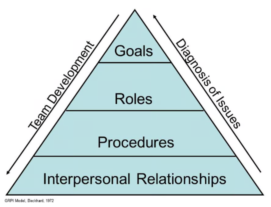

**

# Глава 1. Что такое команда

## История вопроса

Вопрос формирования команд, конечно, не новый. Много кто им задавался и пытался найти ответы. Понимание сущности команд со временем эволюционировало, как и взгляды на то, что такое организация, как она устроена и как ею управлять.

Западная бизнес-мысль, на которую оказали сильнейшее влияние идеи Адама Смита и Генри Форда о разделении труда и механистический подход, только к середине XX века окончательно признала важность человеческого фактора и обозначила существование феномена «сплоченных рабочих групп».

Не претендую на исчерпывающий обзор, но пройтись по основным вехам развития представлений о команде, думаю, стоит. Если хотите поскорее перейти к сути, можете этот раздел пропустить.

Пожалуй, первым существенным шагом можно назвать эксперименты в Хоторне. В ходе исследований на Хоторнском заводе (штат Иллинойс, США), которые продолжались 12 лет (1924-1936), был выявлен феномен неформальной группы в производственном процессе, отношения между членами которой оказывали существенное влияние на производительность труда. В частности, было выявлено, что группе присуще стремление вырабатывать свои собственные внутригрупповые нормы, ценности и позиции, устанавливать контроль за поведением членов группы в процессе труда.

В 30-е годы XX века свое развитие получила школа человеческих отношений (Мери Паркер Фоллет, Элтон Мэйо, Абрахам Маслоу), чему в немалой степени способствовали результаты хортонских экспериментов. По Мэйо, фактор сотрудничества в группе является обстоятельством, по своей значимости сопоставимым с менеджментом, и может оказаться выше по сравнению с факторами материального стимулирования [1]. Это положение теории Мэйо является чрезвычайно важным при рассмотрении теории и практики рабочих команд, где группа из неформальной переходит в категорию формальной структурной единицы организации.

В 40-х годах активно начинают работать группы ученых под руководством Эрика Триста и Курта Левина, которых многие авторы считают основоположниками теории рабочих команд [2]. Так, несомненно, можно заметить влияние теории “Z”, предложенной Левиным и в дальнейшем развитой Лундстедтем (анархический стиль типа “laissez-faire”) на практическое внедрение рабочих команд в фирме IBM [3].

В конце 40-х годов появились группы рабочих, которых по ряду признаков можно было отнести к современному понятию команды. Так, в Южном Йоркшире на шахте в 1949 году была создана первая самоуправляемая рабочая команда [4].

В конце 50-х - начале 60-х годов многие развитые западные страны столкнулись с проблемой, потребовавшей нового взгляда на менеджмент. Развитие производительных сил резко подняло уровень образования рабочих и служащих, и как следствие этого денежные стимулы перестали играть ключевую роль в поддержании высокого уровня производительности труда. Люди хотели не просто работать, но и получать удовлетворение от работы. Поэтому можно с уверенностью сказать, что в 60-х годах ХХ века произошел переворот в сознании людей, который определил появление многих новых разработок в теории менеджмента.

В 1965 году американский психолог и исследователь групповой динамики Брюс Такман описал 4 стадии, которые проходят команды, которые впоследствии оказываются эффективны: forming (формирование), storming («перемешивание»), norming (нормирование), performing (функционирование) [5].

Команда сначала формируется и отделяется от внешнего мира, люди знакомятся между собой, затем происходит «буря в стакане» (“storming”), в результате которой команда перемешивается, выстраивается, определяет внутренние нормы и правила поведения и взаимодействия, а члены команды взаимно подстраиваются (“norming”). И только после этого начинается собственно эффективное функционирование команды как единого целого (“performing”).

**

# Глава 1. Что такое команда?

## История вопроса

Вопрос формирования команд, конечно, не новый. Много кто им задавался и пытался найти ответы. Понимание сущности команд со временем эволюционировало, как и взгляды на то, что такое организация, как она устроена и как ею управлять.

Западная бизнес-мысль, на которую оказали сильнейшее влияние идеи Адама Смита и Генри Форда о разделении труда и механистический подход, только к середине XX века окончательно признала важность человеческого фактора и обозначила существование феномена «сплоченных рабочих групп».

Не претендую на исчерпывающий обзор, но пройтись по основным вехам развития представлений о команде, думаю, стоит. Если хотите поскорее перейти к сути, можете этот раздел пропустить.

Пожалуй, первым существенным шагом можно назвать эксперименты в Хоторне. В ходе исследований на Хоторнском заводе (штат Иллинойс, США), которые продолжались 12 лет (1924-1936), был выявлен феномен неформальной группы в производственном процессе, отношения между членами которой оказывали существенное влияние на производительность труда. В частности, было выявлено, что группе присуще стремление вырабатывать свои собственные внутригрупповые нормы, ценности и позиции, устанавливать контроль за поведением членов группы в процессе труда.

В 30-е годы XX века свое развитие получила школа человеческих отношений (Мери Паркер Фоллет, Элтон Мэйо, Абрахам Маслоу), чему в немалой степени способствовали результаты хортонских экспериментов. По Мэйо, фактор сотрудничества в группе является обстоятельством, по своей значимости сопоставимым с менеджментом, и может оказаться выше по сравнению с факторами материального стимулирования [1]. Это положение теории Мэйо является чрезвычайно важным при рассмотрении теории и практики рабочих команд, где группа из неформальной переходит в категорию формальной структурной единицы организации.

В 40-х годах активно начинают работать группы ученых под руководством Эрика Триста и Курта Левина, которых многие авторы считают основоположниками теории рабочих команд [2]. Так, несомненно, можно заметить влияние теории “Z”, предложенной Левиным и в дальнейшем развитой Лундстедтем (анархический стиль типа “laissez-faire”) на практическое внедрение рабочих команд в фирме IBM [3].

В конце 40-х годов появились группы рабочих, которых по ряду признаков можно было отнести к современному понятию команды. Так, в Южном Йоркшире на шахте в 1949 году была создана первая самоуправляемая рабочая команда [4].

В конце 50-х - начале 60-х годов многие развитые западные страны столкнулись с проблемой, потребовавшей нового взгляда на менеджмент. Развитие производительных сил резко подняло уровень образования рабочих и служащих, и как следствие этого денежные стимулы перестали играть ключевую роль в поддержании высокого уровня производительности труда. Люди хотели не просто работать, но и получать удовлетворение от работы. Поэтому можно с уверенностью сказать, что в 60-х годах ХХ века произошел переворот в сознании людей, который определил появление многих новых разработок в теории менеджмента.

В 1965 году американский психолог и исследователь групповой динамики Брюс Такман описал 4 стадии, которые проходят команды, которые впоследствии оказываются эффективны: forming (формирование), storming («перемешивание»), norming (нормирование), performing (функционирование) [5].

Команда сначала формируется и отделяется от внешнего мира, люди знакомятся между собой, затем происходит «буря в стакане» (“storming”), в результате которой команда перемешивается, выстраивается, определяет внутренние нормы и правила поведения и взаимодействия, а члены команды взаимно подстраиваются (“norming”). И только после этого начинается собственно эффективное функционирование команды как единого целого (“performing”).

Дальнейшее развитие модели, предложенное самим Брюсом Такманом и его последователями, добавило новые стадии, учло вариант, когда команда не распадается после выполнения проекта, а приступает к новому. Принципиально модель не изменилась, оставшись интересным наблюдением и интерпретациями, эффективность которых так и не была подтверждена формальным экспериментом, но на тот момент она всех устраивала, да и сейчас нередко на нее ссылаются из-за ее наглядности.

Тем временем набирала обороты отрасль разработки программного обеспечения, и она столкнулась с новыми вызовами и проблемами. В 1964 компании IBM анонсировала операционную систему OS/360 для своих новых суперкомпьютеров, но разработка продвигалась очень тяжело из-за очень высокой сложности и просчетов в проектировании. Кроме того, бумажная документация проекта была очень объемной: только ежедневные исправления насчитывали около 150 страниц текста, и поддержка рабочей тетради проекта стала занимать значительную часть ежедневного рабочего времени. В результате система была выпущена с существенной задержкой, стоимость разработки в несколько раз превысила запланированную, и не соответствовала техническим требованиям по потребляемой памяти.

Анализируя свой опыт, руководитель проекта Фредерик Брукс написал ставшую классической книгу "Мифический человеко-месяц" (1975) [6], в которой обратил внимание, что производительность группы людей может зависеть от ее численности нелинейно. Т.е. нельзя повысить производительность группы просто увеличив ее численность. Наоборот, добавление людей в отстающий от графика проект сделает проект еще более отстающим. И чем сложнее проект, чем больше в нем внутренних логических взаимосвязей, тем выше издержки на взаимодействие между людьми.

В 70-х еще не было ответа, как быть, если необходимо сделать сложный объемный программный продукт, требующий большого количества "человеко-часов". В своей книге Брукс только сформулировал  проблему крупных программных проектов: "серебряной пули нет" (т.е. нет 100% работающего решения). 

Но в нашем контексте, он озвучил ценное предположение, что выходом может стать создание небольших команд, похожих на операционные бригады врачей, в каждой из которых будут свои высококлассные узкие специалисты. Если каждая бригада будет заниматься своей зоной ответственности, то это может сильно снизить трудозатраты на коммуникации. Кроме того, очень важным является осознание нелинейности, т.е. эффективность группы людей зависит от их количества нелинейно, и на нее влияют такие факторы как сложность задачи и структура коммуникаций.

Классическая производственная модель, которая хорошо подходила для создания продуктов “в металле”, в сфере разработки ПО оказалась нежизнеспособной  —  слишком эфемерен и изменчив продукт. И Фредерик Брукс одним из первых это подметил. Таким образом, начало приходить понимание, что для перехода в новый технологический уклад необходимо выработать новые подходы к взаимодействию.

Далее в 1972 году была предложена Ричардом Бекхардом и позже популяризирована Ирвином Рубином, Марком Пловником и Рональдом Фраем модель эффективности команды GRPI.

В графической форме ее представляют в виде пирамиды. Чтобы команда была эффективной, нужны четыре составляющие:

1. Цели: ясно очерченные цели и желаемые результаты, а также четко заданные приоритеты и ожидания.

2. Роли: четко очерченный круг обязанностей, принятие лидера группой.

3. Процессы: прозрачные процессы принятия решений и рабочие процедуры.

4. Межличностные отношения: успешное взаимодействие, доверие и гибкость.

Модель GRPI предлагается использовать как для создания новых команд, так и для аудита и развития существующих. Ну, допустим.

Следующая веха  —  работа Реймонда Белбина (1975 - 1981) [7], в рамках которой был применен, по сути, эволюционный алгоритм (вероятно, он вдохновился книгой Джона Холланда «Адаптация в естественных и искусственных системах» 1975 года). Эксперимент Бэлбина заключался в том, что он формировал команды из студентов Колледжа менеджмента Хенли и организовывал соревнование между ними по решению различных задач. Затем отбирал сильнейшие команды, переформировывал те, которые оказались слабее, и повторял соревнование снова. Параллельно он исследовал то, как люди общаются в процессе решения поставленных задач и на основе полученных результатов выделил 9 (первоначально 8) ролей, наличие которых в команде способствует достижению наиболее высоких результатов: «душа команды», «координатор» (или «председатель»), «генератор идей», «собиратель идей» (или «исследователь ресурсов»), «стратег-аналитик», «шейпер» (или «контролер»), «специалист» и «реализатор».

Данную модель пытаются применять и сейчас, и она известна как модель Белбина. Но на мой взгляд, интереснее то, что результатом работы стал также вывод, что наиболее эффективными являются команды численностью 4-5 человек. К вопросу, почему это так, мы еще вернемся  —  теперь этому есть научное обоснование. 

Книга Тома Демарко и Тимоти Листера “Человеческий фактор. Успешные проекты и команды” [8], вышедшая в 1987 году, стала сборником тех ошибок, которые совершают корпорации, пытаясь по своему разумению организовать труд людей. В исходном варианте книга называется «Peopleware» (игра слов, созвучная со словом «Software»), и главная идея книги заключается, пожалуй, в том, что люди  —  не машины, и они умеют взаимодействовать совершенно «не механистическим» образом. Т.е. на западе это даже в середине 80-х было еще неочевидно!

Но особо хотелось бы обратить внимание на очень удачный, на мой взгляд, термин "кристаллизация", означающий финальную стадию формирования команды: «Команда, прошедшая кристаллизацию, – это группа людей, столь сильно связанных, что целое становится больше суммы составляющих его частей». Это очень важное замечание, подчеркивающее, что в группе людей, которая становится командой, происходит своеобразный фазовый переход: в какой-то момент что-то изменяется во внутренней структуре, и возникают новые свойства.

Демарко также описал признаки кристаллизации команд, к которым мы еще вернемся.

В 90-е годы в области разработки ПО произошел бум средств «быстрой разработки» (RAD, или Rapid Application Development) и фокус с команд временно сместился. Мейнстрим западной управленческой науки тем временем продолжал собирать кейсы и придумывать модели, но принципиальных сдвигов не произошло. Например, книга Джона Катценбаха и Дугласа Смита “Командный подход: создание высокоэффективных организаций” («The Wisdom of Teams») [9], которая переиздавалась с 1993 по 2003 годы с дополнениями, лишь повторяет, что команды могут быть сверх-эффективны, что «группы не становятся командами по приказу свыше», говорит о приверженности, зачем-то разделяет просто команды и высокоэффективные команды и вдруг сообщает, что высокоэффективные команды невозможно создать специально. Авторитет авторов и их опыт в консалтинге не вызывает сомнений, но вывод очень странный.

Также они предложили свою модель жизненного цикла команды, которая состоит из следующих стадий:

1. **Рабочая группа**, где взаимодействие участников осуществляется для обмена информацией и опытом.

2. **Псевдокоманда**, в которой ее члены могут увеличить эффективность работы, но не прилагают для этого никаких усилий.

3. **Потенциальная команда**, в которой понимают общую цель и ее необходимость и пытаются выработать эффективные способы сотрудничества.

4. **Настоящая команда** — в ее составе участники, которые обладают взаимодополняющими навыками и умениями. Они осознают общие цели и задачи и совместно работают над ними.

5. **Высокоэффективная команда** с характеристиками настоящей команды и способствующая индивидуальному развитию ее членов, и поэтому ее результаты обычно превосходят ожидания.

Кроме того, авторы предложили модель эффективной командной работы в виде треугольника, углы которого соответствуют основным результатам командной деятельности: продуктам коллективного труда, показателям эффективности и личному росту. В достижении этих целей, по мнению авторов, важную роль играют три основных фактора, образующие стороны треугольника:

- Приверженность. Приверженность участников команды общей задаче, поставленным целям и единому подходу к делу.

- Взаимодополняемые навыки. Участникам команды необходимы навыки решения проблем, технические навыки для выполнения своих профессиональных обязанностей и навыки межличностного общения для улучшения командной работы.

- Взаимная ответственность. Участники команды несут взаимную ответственность друг перед другом, а также личную ответственность за свою часть работы, и в идеале такие команды должны состоять из небольшого числа людей.
