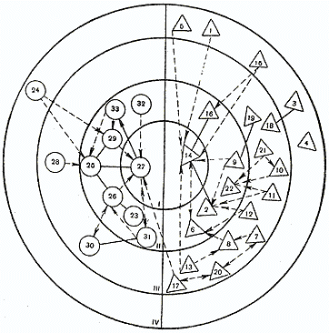
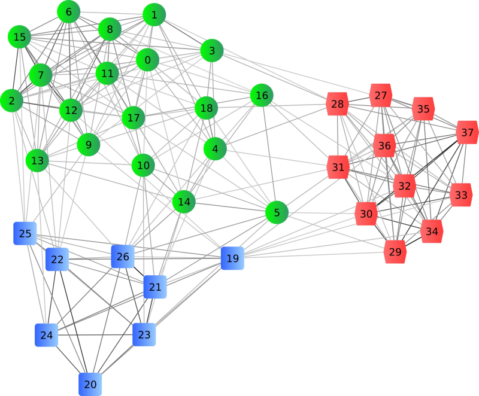

# Глава 2. Анатомия социальных систем

- Команда — специфический тип социальных систем, свойства обусловлены системообразующим фактором. Система — совокупность объектов и связей между ними, функционирующая как единое целое, и обладающее свойствами, которых нет у частей системы по отдельности.

- С точки зрения теории систем, команда — открытая система, которая находится в состоянии динамического равновесия (когда внутренние и внешние силы сбалансированы). Команды отличаются большой гибкостью и находятся в состоянии подвижного равновесия (или гомеостаза). Обычно у таких систем есть набор наиболее вероятных состояний, поэтому при изменениях среды они способны подстраиваться и адаптироваться. И поэтому управление прямыми управляющими воздействиями может быть неэффективно — команда способна выработать к ним адаптацию.

- Команды — недетерминированные системы, состояние которых невозможно точно предсказывать на достаточно длинном промежутке времени (как прогноз погоды). Даже повторяя одни и те же действия в абсолютно одинаковых условиях с абсолютно одинаковыми командами можно получать совершенно разные результаты. Поэтому универсальный алгоритм с предсказуемыми результатами (технология) создания и трансформации команд принципиально невозможен.

- Команды способны к самоорганизации, т.е. изменении своей внутренней структуры при возникновении длительно воздействующего на него фактора. Понимание системной природы команд может дать ключ к осознанному управлению через самоорганизацию.

- Команды состоят из людей, а мы как представители своего вида имеем эволюционно обусловленные особенности взаимодействия, которые важно учитывать. К ним относятся личная и групповая идентичность, пространство культуры, ритуалы, механизмы управления безопасностью. В нашем мозге есть особые области, которые отвечают за обработку невербальных сигналов и социальных угроз, и которые определяют то, как мы взаимодействуем.

- Структуру социальных систем тоже можно исследовать. Если картографировать взаимодействия с помощью модели социальной сети, то можно анализировать как личные сети взаимодействий, так и общую структуру сети (эгоцентрический и структурный подход). Структурный подход позволяет выявлять кластеры внутри таких систем. Но отслеживание этих взаимодействий в режиме реального времени видится крайне сложно осуществимой задачей.

## Системные свойства

Команда — специфический тип социальных систем, свойства обусловлены системообразующим фактором. В то же время команды проявляют системные свойства, характерные целому классу систем не только социальных, но и встречающихся в самых различных обастях. Поэтому рассмотрение команды с этих позиций может дать нам понимание природы протекающих в ней процессов и реакций на внешние воздействия.

### Команда как система

Понятие системы в науке появилось сравнительно недавно и изначально системы исследовались в естественнонаучных дисциплинах. Позднее кибернетика, теория информации, теория хаоса, теория игр, факторный анализ и теория систем собрали и систематизировали достаточно знаний, чтобы уже с уверенностью говорить о том, что системы повсюду. Они бывают разные по своим свойствам, но это фундаментальное свойство материи — объединяться в системы. Понимание того, что социальные явления тоже должны рассматриваться как системные, начало формироваться еще в 70х годах XX века, но вопрос практического применения пока сложный, и связан не столько с большой сложностью социальных систем, сколько с этической составляющей. Впрочем, это не всех останавливает, и социальные технологии применяются не только в маркетинге, но и «грязных» манипуляциях массовым сознанием. Поэтому изучать вопрос нужно.

Начнем с краткого введения, а те, кому этого будет недостаточно, смогут обратиться к рекомендуемой литературе.

Итак, система — совокупность объектов и связей между ними, функционирующая как единое целое, и обладающее свойствами, которых нет у частей системы по отдельности. Такие свойства называют эмерджентными.

Автомобиль — техническая система, которая благодаря взаимодействию своих элементов может преобразовывать энергию горящего топлива в движение. Но если его разобрать, то он перестанет быть системой и утратит данное эмерджентное свойство.

Команда тоже обладает эмерджентными свойствами: устойчивостью, адаптивностью и более высокой эффективностью.

Свойство устойчивости подразумевает, что команда находясь в некотором устойчивом состоянии, старается это состояние сохранить, даже если на нее воздействуют извне. Кроме того, невозможно просто так взять и исключить из команды кого-то или расформировать ее — команда будет продолжать сохранять связи до тех пор пока это не станет слишком энергетически затратно.

Адаптивность помогает команде сохранить устойчивость и подстроиться под изменения. Если кто-то из команды заболел, то его функции будут перераспределены между остальными без лишних споров и уговоров. Команды отлично справляются с пиками нагрузки — если есть такая необходимость, то члены команды сами перераспределяют усилия и найдут способ, чтобы справиться со сложностями. Иногда для этого приходится проявлять не только гибкость, но и изобретательность. И как подмечали многие авторы, членам команды это даже нравится, потому что дает возможность почувствовать свою особенность.

Именно поэтому команды и проявляют такую эффективность в стрессовых ситуациях или при необходимости решать сложные задачи. Этому также помогает эффективность взаимодействий и высокая вовлеченность.

Есть и другие более сложные свойства: способность к самоорганизации и самовоспроизведению. Но чтобы разобраться с ними стоит познакомиться с основами теории систем.

### Открытые системы и гомеостаз

Как и в случае с командами в  науке об управлении кибернетике и теории систем изначально превалировал механистический подход. Например, один из основателей кибернетики Уильям Эшби рассуждал о «фундаментальном понятии машины» [1] и предполагал, что «внутреннее состояние машины и состояние окружающей среды однозначно определяют последующее состояние машины». Но в этой же книге он представил свою теорию саморегулирующихся систем и обсуждал понятие машины как системы, способной реагировать и адаптироваться к своей окружающей среде. Для этого он вводит понятие  системы как «машины со входом», т.е. открытую для информации, но закрытую для передачи энтропии.

Энтропия  —  это мера неупорядоченности или, упрощенно, мера хаоса. Чем выше энтропия, тем больше неопределенность и беспорядочность внутри системы.

Похожую идею можно найти в работе еще одного основателей кибернетики Норберта Винера "Кибернетика, или Управление и связь в животном и машине" [2]. Винер предложил концепцию открытых и закрытых систем в контексте обратной связи и взаимодействия систем с окружающей средой.

С течением времени понятие открытых и закрытых систем было доработано и применено в различных областях, включая информационные технологии, биологию, управление организациями и другие.

В общем смысле, закрытая система  —  это система, которая отделена от окружающей среды и не обменивается с ней энергией, веществом или информацией. В закрытых системах все внутренние процессы происходят внутри системы без внешнего влияния. Примером закрытой системы может служить изолированная химическая реакция в закрытом сосуде при постоянной температуре, где нет обмена веществами и энергией с окружающей средой.

С другой стороны, открытая система — это система, которая взаимодействует с окружающей средой и обменивается энергией, веществом или информацией с внешней средой. Она открыта для внешних воздействий и влияний, что позволяет ей меняться и развиваться. Примером открытой системы может служить живой организм, который принимает пищу, обменивается веществами с окружающей средой и взаимодействует с другими организмами.

Открытые системы отличаются большой гибкостью и находятся в состоянии подвижного равновесия (или гомеостаза). По сути, у них есть некий набор наиболее вероятных состояний, поэтому при изменениях среды они способны подстраиваться и адаптироваться. Это множество состояний еще иногда называют «полем плодородия», подразумевая, что в этих состояниях системе «комфортно», и она функционирует эффективно.

На границах «поля плодородия» находится зона дискомфорта, попадая в которую система получает сигналы, что есть угроза для ее существования, и надо что-то делать.

Оказалось, что все живое на нашей планете организуется в такие открытые системы, причем эти системы организованы иерархически: бактерии и клетки образуют более сложные организмы, те в свою очередь могут объединяться в группы (семьи пчел, стаи и т.п.), которые свою очередь собираются в видовые популяции, которые встраиваются в экосистемы и функционируют в симбиозе. Бактерии как биофабрики расщепляют и синтезируют вещества, которые становятся питательной средой для других, растения с помощью солнечной энергии синтезируют материал для своих листьев и плодов, травоядные поедают растения, а хищники  — травоядных. Организмы сами по себе обладают свойствами адаптации к окружающим условиям, популяции травоядных и хищников саморегулируются по численности, экосистемы адаптируются к меняющемуся климату.

Более того, такие системы стремятся экономить энергию и не делать то, в чем нет необходимости. Это свойство объясняется в кибернетике принципомом наименьшей диссипации (рассеяния) энергии, и оно обусловлено фундаментальными свойствами материи.

Как вы уже, наверное, поняли, команды  —  это частный случай открытых систем, они тоже находятся в состоянии динамического равновесия, стремясь сохранить себя, адаптироваться и тратить как можно меньше энергии.

> **Инсайт**
> 
> Управлять командой прямыми управляющими воздействиями неэффективно.

На внешние воздействие команда, стремясь сохранить свое подвижное равновесие и энергетически эффективный режим функционирования, вырабатывает адаптивную реакцию. Если внешний менеджер требует от команды, к примеру, каждую неделю присылать отчет о выполненной работе, то команда будет сначала стараться не выполнять это требование. Если же менеджер будет проявлять настойчивость, напоминая об отчете, то команда может выделить внутреннюю функцию по подготовке отчета (т.е. кто-то из команды вызовется этот отчет делать, чтобы остальные не отвлекались, а за это получит благодарность, доверие и другие бонусы). Но как только менеджер перестанет напоминать об отчете, команда перестанет его делать. Кроме того, управляющее воздействие может вызвать и прямо противоположную реакцию.

Эта особенность команд пугает некоторых менеджеров, но тут просто надо принять факт того, что команды такие, и скорректировать свой подход.

### Стохастическая природа команд

И здесь мы подходим к пониманию еще одного важного свойства команд. Дело в том, что системы бывают детерминированные и недетерминированные (или стохастические).

Первые отличаются тем, что их состояние можно однозначно предсказать во времени с учетом управляющих воздействий. Если вы нажимаете на педаль газа, то топливная система автомобиля увеличивает поступление бензина в цилиндры двигателя, двигатель увеличивает обороты, колеса крутятся быстрее, машина ускоряется. Причина и следствие имеют прямую и очевидную связь. Система детерминированная, т.к. ее состояние однозначно определяется во времени.

Точное состояние стохастических систем определить невозможно, т.к. взаимодействия в них слишком сложные (с циклами обратной связи, которые усиливают одни факторы и гасят другие), кроме того, в таких системах может быть источник случайности. Случайные факторы и флуктуации играют важную роль в их поведении. Невозможность точного предсказания погоды хотя бы на неделю вперед связана именно со стохастической природой климатических моделей, и здесь любые суперкомпьютеры бессильны. Это и есть тот самый “эффект бабочки” из теории хаоса: взмах крыла бабочки или малейшее случайное событие могут породить цунами в другом полушарии (а может и не породить).

Хаос не означает полный беспорядок и неопределенность — мы можем говорить о том, что одни состояния системы будут более вероятны, чем другие. Например, вероятность того, что в субтропиках летом пойдет снег, почти нулевая, но такое иногда случается. Множества таких вероятных состояний называют аттракторами. Аттракторы могут быть подвижными. Например, погодная норма может сдвигаться в зависимости от сезона. Но в целом климатическая система находится в динамическом равновесии.

Социальные системы тоже имеют сложные внутренние связи, а источником неопределенности может быть не только внешняя среда, но и сами люди, ведь мы иррациональны по своей природе (хоть и думаем о себе обратное). Поэтому команда, как частный случай социальных систем, тоже имеет стохастическую природу.

Что нам это дает?

> **Инсайт**
> 
> Универсальный алгоритм с предсказуемыми результатами (технология) создания и трансформации команд принципиально невозможен.

Даже повторяя одни и те же действия в абсолютно одинаковых условиях с абсолютно одинаковыми командами можно получать совершенно разные результаты. Но, тем не менее, часть из возможных состояний окажутся более вероятны, формируя аттракторы.

Теоретически, оценивая вероятности, мы можем осознанно создавать условия и производить корректирующие воздействия, для того, чтобы наша команда сформировалась, выработала внутренние механизмы и функционировала максимально эффективно.

Подробнее об этом поговорим в разделе о трансформации команд.

### Самоорганизация

У недетерминированных систем обнаруживается удивительная способность организовывать и координировать свою структуру, поведение и функционирование без внешнего вмешательства или контроля. Этот процесс основывается на внутренних взаимодействиях и динамике компонентов системы и получил название самоорганизация.

С точки зрения теории систем, самоорганизация  — это снижение энтропии (т.е. увеличение упорядоченности) за счет внешней энергии и информации.
Живые системы, такие как клетки, организмы и экосистемы, обладают свойством самоорганизации, которое позволяет им достигать стабильности, адаптивности и эффективности в сложных и изменяющихся условиях. Это происходит за счет взаимодействия между компонентами системы и эмерджентного поведения, когда коллективное поведение системы возникает из простых правил взаимодействия между ее составляющими.

Примером самоорганизации в живых системах может служить развитие эмбриона: вначале группы клеток, не имеющих четкой структуры, постепенно формируют определенные паттерны и структуры, которые определяют будущую анатомию и функции организма.

Самоорганизация также наблюдается в поведении животных. Например, муравьи или птицы могут сотрудничать и координировать свои действия без централизованного управления. Они следуют простым правилам взаимодействия, таким как обмен информацией или подражание поведению ближайших соседей, что приводит к эмерджентным свойствам, таким как образование стай или роя.

В целом, самоорганизация в живых системах является важным механизмом, позволяющим им адаптироваться к окружающей среде, обеспечивать устойчивость и эффективность в сложных условиях и обладать свойствами, которые не могут быть объяснены только свойствами и поведением отдельных компонентов системы.
Команды как частный случай подобных систем тоже способны самоорганизовываться: для достижения цели члены команды совместно упорядочивают и развивают структуру, взаимодействие и поведение без внешнего управления. Самоорганизация не означает самостоятельное формирование команды (хотя такое иногда случается в определенных условиях). Речь идет о свойстве, которое проявляют уже сложившиеся команды: способности самостоятельно перераспределить внутри себя функции и зоны ответственности. Например, команда при возникновении регулярной задачи может выделить ответственного или придумать правило, определяющее порядок ее выполнения.

Понимание системной природы команд может дать ключ к осознанному запуску и управлению процессом самоорганизации, и мы к этой теме вернемся в последующих главах.

А еще по этой теме рекомендую почитать книгу Арташеса Газаряна "Менеджер и организация" [3].

## Социальные механизмы

Люди взаимодействуют между собой очень специфическим образом, т.к. эволюция нашего вида так сложилась, что принадлежность к какому-либо коллективу, стае или племени стала критической для выживания. Возникло это до того, как наши предки стали разумными, и как показывают современные исследования, в нашем мозге есть специализированные области, которые помогают нам эти взаимодействия поддерживать, и которые не связаны с логическим мышлением. Поэтому чтобы лучше понять, как работает команды, важно исследовать как люди взаимодействуют, и как это влияет на системную динамику.

### Свой-чужой и идентичность

Когда наши предки из-за осаванивания африканской равнины оказались вынуждены все чаще спускаться на землю, чтобы перебраться с одного дерева на другое, начался наш эволюционный путь. На открытых пространствах наши предки оказались беззащитны перед появившимися в то время крупными кошачьими и другими хищниками. И единственный вариант выжить в такой ситуации  — собраться в стаю. Так проще вовремя замечать готовящееся нападение хищников и проще защищаться.

Таким образом способность жить с другими стало фактором естественного отбора, это обусловило развитие нашего мозга, и эти особенности до сих пор влияют на то, как мы общаемся и строим отношения.

Чтобы занять выгодное положение в обществе необходимо чутко реагировать на настроение сильных, выявлять чужие отношения по едва заметным жестам, мимике и другим невербальным сигналам, а также анализировать сплетни.

В начале 2000-х годов нейрофизиологи открыли несколько отдельных нейронных сетей, и одна из таких сетей специализируется именно на восприятии и на обработке невербальной информации, а также анализе социальных угроз. Т.к. она не связана с нашим рациональным мышлением и включается в тот момент, когда мы не заняты сосредоточенным обдумыванием чего-либо, её назвали сетью пассивного режима работы мозга [4] (СПРРМ, также нейронная сеть оперативного покоя; по-английски «default mode network» или кратко DMN).

Интересно, что СПРРМ работает без активации участков мозга, отвечающих за рациональное мышление, концентрацию внимания и решение сложных задач. Более того, она может работать только в противофазе, т.е. когда мы не думаем над решением задач, требующих рациональных рассуждений. Иногда нам трудно словами объяснить, почему мы испытываем дискомфорт и иррациональную тревогу при общении в группе людей, потому что результаты обработки невербальной информации произошли в отдельной области мозга, и для их рационального осознания и вербализации нужно иметь определенные навыки.

Эксперименты показали, что маленькие дети интерпретируют геометрические фигуры как «плохие» или «хорошие» уже в один год, т.е. до того как развиваются речь и логика. Ребенок видит, что катящемуся кругу вдруг преграждает дорогу треугольник. И ребенок тут же понимает, что треугольник «плохой». В то же время ребенок понимает, что квадрат хороший, если он тащит круг за собой (т.е. помогает). СПРРМ ребенка создает внутреннюю модель социальной ситуации, определяющую понятия «друг» и «враг» в отношении квадрата и треугольника [5]. Очевидно, это помогало выжить в дикой природе — в беззащитном возрасте лучше держаться подальше от агрессивных и поближе к проявляющим эмпатию сородичам.

Чтобы сделать этот «фоновый» анализ социальных угроз менее энергозатратным, люди выработали систему идентификаторов, которые позволяют подтвердить принадлежность к группе и обозначить статус в социальной иерархии. Узор на национальном костюме, кольцо на пальце или в ухе, татуировки, военная форма или костюм и определенные часы на руке — все это внешние атрибуты, которые работают как маркеры системы «свой-чужой», а также признаки статуса в социальной иерархии. Мы оцениваем их без включения рационального мышления и существенных энергозатрат СПРРМ.

Социальные идентификаторы можно и нужно формировать внутри команды — они помогут укрепить чувство идентичности и причастности, но сотрудников недостаточно одеть в корпоративные цвета, чтобы они стали командой. Возможна и обратная реакция: люди могут и объединиться в своем презрении к корпоративным цветам.

Как работать с идентификаторами поговорим в главе в контексте решения типовых задач менеджера при работе с командами.

### C-пространство и язык

Идентификаторами могут быть не только внешние признаки, но и термины, сленговые слова или культурные ссылки (цитаты или шутки из книг и фильмов, например), которые могут показывать принадлежность к профессиональному сообществу или субкультуре. Любое сообщество формирует свою уникальную систему культурных идентификаторов, и к командам это тоже относится. Способность говорить на языке команды, понимать ее язык и культурные отсылки автоматически делает человека своим.

Но культурные идентификаторы — это верхушка айсберга, всего лишь проявления более глубоких и сложных процессов, протекающих в социальных системах. Недостаточно присылать мемы в общий чат, чтобы все над ними посмеялись и "прониклись корпоративной культурой".

Очевидно, что каждое человеческое сообщество обладает комплексом культурных особенностей, традиций, ценностей и истории. В книге М. Уорнера, В. Моргена "Виртуальные организации. Новые формы ведения бизнеса в XXI веке" (2005) [6] я столкнулся с понятием пространства культуры или c-пространства ("c" от английского "culture"), которое соответствует этой концепции. Правда, конкретного определения пространства культуры в самой книге нет, поэтому сформулируем его самостоятельно, исходя из наших практических потребностей:

> Пространство культуры — это совокупность ценностей, общественных норм, исторического и культурного контекста (традиций, ритуалов, мифологии, истории) и языка, свойственная группе людей, осознающих себя единой общностью.

Важно понимать, что каждый человек может одновременно идентифицировать себя с несколькими c-пространствами, и непротиворечиво их синтезировать в своем сознании. Например, человек может одновременно идентифицировать себя русским православным байкером и, скажем, музыкантом; или студентом-анимешником-программистом. И у каждой такой общности есть свои символы, свой сленг, свой культурный контекст.

Здесь стоит упомянуть теорию двойной наследственности, которая была разработана 1960 — 1980-х годах с целью объяснить человеческое поведение с точки зрения двух различных, но взаимодействующих процессов: генетической эволюции и культурной эволюции. Одно из центральных утверждений этой теории заключается в том, что частично развитие культуры происходит по аналогии с генетической эволюцией в процессе дарвиновского отбора [7]. Т.е. различные сообщества под влиянием внешних факторов формировали различные культурные модели, а затем при столкновении этих сообществ происходил отбор более жизнеспособных, и те передавали своё "культурное ДНК" следующим поколениям в точности, как живые организмы передают свой геном потомкам. Разумеется культурные модели не оставались статичными, и иногда происходил их синтез, что создавало новые общности, которые в процессе конкуренции также проверялись на жизнеспособность.

Таким образом, c-пространство очень сложно "синтезировать в пробирке", т.к. это продукт длительной совместной деятельности и многократного синтеза. Поэтому я бы не стал расчитывать на возможность создания "командной культуры" с нуля. Но можно взять субкультуру ИТшников, анимешников и т.п. и вносить в нее особенности, которые сделают формируемое пространтсво уникальным.

> **Инсайт**
> 
> Если люди культурно близки, то им проще синтезировать свои пространства культуры в общее c-пространство.

Как это делать мы обсудим ниже, а пока хотелось бы обратить внимание на еще один важный аспект c-пространства — язык, т.к. культура находит свои проявления и в языковых особенностях конкретных социальных групп. В самом простом варианте это может быть специфический словарь сленговых слов, но также могут возникать новые слова и категории, описывающие важные для данной социальной группы аспекты реальности или культурные отсылки. Поэтому язык может дать важные зацепки при анализе c-пространств и даже стать одним из инструментов.  

### Ритуалы

Другой способ подтвердить принадлежность к группе  — подражание сородичам. Это простейший способ социализации, и этот очень древний механизм, очевидно, возник задолго до рационального мышления.

По мере усложнения поведения повторяемые действия стали становиться сложнее и разнообразнее, выстраиваться в последовательности и стали приобретать определённый смысл. Видимо, так и появились ритуалы.

Ритуал — это последовательность действий, которую люди совершают совместно. Причем данная последовательность действий должна быть всем знакома, что освобождает от лишних коммуникаций. Все знают, что в каком порядке должно происходить, и кто за что отвечает.

Ритуалы есть не только у высших приматов, но и других млекопитающих. Например, кошки используют ритуалы для подтверждения, что все хорошо: когда хозяин возвращается домой, надо обязательно поваляться перед его ногами в прихожей, пока тот разувается, немного поласкаться, потом отвести к миске и немного поесть при нем и т.д. Все это позволяет проверить, что все в порядке, хозяин будет кормить и любить как прежде  —  котик ведь не знает, где вы были целый день и, возможно, думал утром, что вы ушли навсегда. Вероятно, этот навык у кошек возник благодаря долгому общению с людьми, но тем не менее, они практикуют ритуалы, и нарушение ритуальной последовательности может заставить их нервничать.

До недавнего времени ритуалы изучались исключительно с позиций антропологии и культурологии, а лежащие в основе ритуалов когнитивные механизмы оставались без внимания. Но буквально несколько лет назад начали появляться научные работы, в которых ритуалы исследуются с точки зрения психологии поведения и когнитивной психологии [8].

Как я уже писал ранее, мы — социальные существа, и принадлежность индивидуума к группе в определенный период нашей эволюции как вида стала критически важной для выживания и сработала как фактор естественного отбора. Поэтому человеческие ритуалы намного сложнее, чем у других видов, т.к. они нужны не только для того, чтобы убедиться, что все в порядке и не о чем беспокоиться.

Ритуалы в человеческих сообществах (и командах, как их частном случае) имеют следующие функции:

1. Синхронизация ценностей, целей, социальной иерархии через ритуальное воспроизведение действия, в котором каждый знает свою роль и место. Такие ритуалы особенно полезны перед ответственными или опасными мероприятиями. Например, перед большой охотой, началом репродуктивного цикла или морским походом.

2. Подтверждение принадлежности индивидуумов и целостности сообщества. Ритуалы могут играть как роль социального идентификатора, так и культурообразующим элементом. Частным случаем можно также считать особые ритуалы посвящения, в результате которых нового человека принимают в сообщество, и он становится «своим». В качестве примеров можно привести посвящение во взрослую жизнь, воинскую или профессиональную касту.

3. Управление эмоциями. Ритуалы успокаивают, потому что участвующие в нем люди ощущают, что все идет по определенному плану, все нормально и обычно, все занимают свои социальные роли, никаких неожиданностей не предвидится. Участие в ритуале усиливает ощущение причастности, что в свою очередь притупляет страх быть отверженным.

Регулярные ретроспективы и другие структурированные встречи в Agile-практиках ритуалами называют неспроста — они задают определенный ритм работы, но при этом играют важную роль в сохранении целостности команды и тоже могут иметь терапевтический эффект.

Т.к. механизм ритуала очень древний, то он особенно хорошо действует, когда действия связан с пищей и физической деятельностью. Например, совместный заказ обеда в офис, регулярные встречи у кофе-машины, совместное приготовление пищи или поход на природу с шашлыками или посиделками у огня. И конечно, ритуалы являются неотъемлемой частью c-пространства, поэтому они могут стать ценным инструментом для формирования уникальной социальной системы и команды.

### Безопасность

С древнейших времен животные и наши предки собирались в группы для того, чтобы обеспечить свою безопасность, потому что так проще отслеживать угрозы и отбиваться от хищников. Безопасность  — это базовая функция любого социального объединения и команды в частности.

Собираясь в сообщество мы как бы заключаем негласное соглашение о сотрудничестве в общих интересах, и это соглашение существует за счет баланса личных и коллективных интересов. Например, древние люди стали делиться друг с другом пищей, хотя это кажется нелогичным: ты поймал добычу, и тебе меньше достанется, если будешь делиться. Но эта стратегия приносит плоды в долгосрочной перспективе: если в следующий раз от тебя удача отвернется, то это не означает, что ты останешься голодным, потому что в племени есть другие охотники, а женщины наверняка, собрали какие-то ягоды и корешки. Есть и другие важные следствия.
Во-первых, более сильный и удачливый охотник получает еще и социальные бонусы, потому что его вклад в общее благополучие выше. Все хотят быть к нему ближе, чтобы иметь более высокие шансы на выживание, и для этого оказывают ему знаки внимания, работает половой отбор, и всем хорошо. Одинокий же охотник может погибнуть вне зависимости от остальных качеств, если удача отвернется от него несколько раз подряд. Т.е. социализация в трудные времена стала фактором естественного отбора, а в последствии позволило высвободить ресурс для творчества, развития орудий труда и культуры.

Если сообщество перестает давать преимущества его членам в течение какого-то времени, то возникают тенденции к его распаду. Если племя сидело месяц-другой без нормальной еды, то в нем обязательно появлялись желающие отколоться и попытать счастья на стороне. Иногда им везло, иногда нет, но зато получалась диверсификация. Такое поведение повысило шансы выживания вида в целом.

С безопасностью работает аналогичное соглашение. Вместе проще защищаться от различных угроз, и люди за свою историю выработали множество коллективных защитных инструментов. И потом находясь в коллективе чувствуют себя в безопасности, если внутри коллектива нет борьбы за статус и ресурсы. Причем, безопасность бывает индивидуальная и коллективная.

Индивидуальная безопасность  —  это отсутствие угроз для конкретного индивидуума, коллективная безопасность  —  отсутствие угроз для всей группы. Интересно, что это не всегда взаимосвязанные состояния. Например, сам по себе коллектив может быть сильным и устойчивым, но в нем может развернуться нешуточная борьба за власть, которая будет создавать индивидуальные угрозы для одних, но никак не повлияет на других. И наоборот, индивидуумы могут себя почувствовать под угрозой, если они идентифицируют себя как часть социальной группы. Обе ситуации могут приводить к серьезным групповым динамикам и социальным процессам.

Поэтому очень важно отслеживать чувство индивидуальной и коллективной безопасности в команде, т.к. это важный маркер состояния социальной системы.

О степени внешней безопасности можно также судить по склонности к иерархичности. Формальных исследований влияния внешних угроз на иерархичность социальных систем я, к сожалению, не нашел. Но нидерландский исследователь приматов Франс Де Вааль в своей книге "Наша внутренняя обезьяна. Двойственная природа человека" обратил внимание, что: "субординация побеждает демократию всякий раз, когда требуются решительные действия. Мы спонтанно переключаемся в более иерархический режим в зависимости от обстоятельств" [9].

## Структура социальных систем

Структура внутренних связей всегда играет огромную роль, т.к. во-первых, обусловлена функционалом системы, во-вторых, в свою очередь существенно влияет на свойства самой системы и то, как она реагирует на внешние изменения.

### Подходы к анализу социальных систем

Работая лагере для беженцев во время Первой мировой войны, выпускник Венского университета Якоб Леви Морено обратил внимание, что можно улучшить условия жизни переселенцев, если, при размещении людей по баракам, учитывать их национальность, веру и политические взгляды (интересно, что 100 лет назад это не было очевидным). Чтобы реализовать данную идею Морено начал разрабатывать метод исследования социальных связей людей, который назвал социометрией.

 Упрощенно социометрическое исследование выглядит следующим образом: 

1. Участникам исследования задаются вопросы, с кем из группы они готовы совместно решать задачи, делиться переживаниями и наоборот, кто вызывает недоверие и нежелание взаимодействовать.

2. В результате обработки ответов формируется матрица выборов, которая может быть графически представлена в виде графа. Такой социометрический граф «притяжений» и «отталкиваний» называют социограммой. 
   
   

3. На основе собранных данных рассчитываются социометрические индексы: социометрический статус участников исследования, индекс групповой сплоченности (или психологической взаимности), коэффициент взаимности и другие.

В середине 2000-х начался бум социальных сетей, когда появились Facebook, Linked-In, MoiKrug, VKontakte, Одноклассники и десятки других проектов, которые позволяли найти человека онлайн и «подружиться» или зафиксировать факт вашего знакомства с помощью электронной социальный связи. 

На самом деле термин «социальная сеть» был введен в 1954 году английским антропологом Д. Барнсом (J. A. Barnes)  в работе «Классы и собрания в норвежском островном приходе» [10]. Но ещё до этого социологи выражали мнение о важности рассмотрения общества как сложного переплетения различных социальных связей. Сетевой подход и сетевая теория берут своё начало в основаниях социологии, социальной психологии и социальной антропологии, а сетевой подход развивает социометрию Якоба Морено применительно к исследованию крупных человеческих сообществ.

В конце 1960-х известный исследователь социальных сетей Стэнли Милграм увлекся идеей посчитать количество связей, по крайней мере, в пределах США. В ходе своего эксперимента Милграм установил, что средняя степень удаленности участников равна 5,5. После несложных округлений появилось понятие шести степеней удаленности (six degrees of separation) [11]. К концу 70-х окончательно сформировался комплекс социологических и математических методов исследований, которые составляют научный фундамент современного анализа социальных сетей (social network analysis, SNA), но вычислительные мощности еще были недостаточными для того, чтобы модель социальной сети была применима на практике.

И вот в 2004 году вышла в свет книга Роба Кросса "The hidden power of social networks: understanding how work really gets done in the organizations" [12], в которой метод исследования организаций с учетом целого ряда аспектов социальных взаимодействий (обмен информацией и знаниями, принятие решений, взаимное влияние и мотивация, дружба и т.п.) и дает конкретные рекомендации по сбору данных и интерпретации результатов. Выход этой книги как раз и совпал с запуском первых сервисов социальных сетей в интернете.

Благодаря развитию вычислительной техники сейчас мы имеем готовые инструменты, которые не только позволяют проводить подобные исследования не вставая из-за компьютера, но и существенно расширяют набор исследуемых аспектов социальных взаимодействий. Здесь, я думаю, больше всех продвинулись мои коллеги из российской компании BSSL, которые разработали методику и онлайн-сервис исследования «Азимут 2.0». Данный инструмент позволяет выявлять конфликты и проблемы в коммуникациях (например, избирательную доступность, низкий авторитет у руководителя и т.п.), а также проводить анализ личных сетей взаимодействий выбранных сотрудников — такой подход к анализу называют эгоцентрическим.

Эгоцентрический анализ хорош для анализа взаимодействий в небольшой по численности группе.

Второй подход — структурный анализ — направлен на исследование структурных характеристик сети взаимодействий, и этой темой я когда-то сам немного занимался в рамках своей научной работы. К типовым задачам здесь относится исследование связности сети взаимодействий (сколько человек нужно убрать из социальной системы, чтобы она распалась), выявление признаков, по которым люди группируются в коллективах и т.п. Тема очень сложная, большая, имеет много этических проблем и, к сожалению, в этой области очень мало открытых исследований.

### Системообразующий фактор

Системообразующий фактор — это сила, объединяющая множество в одну систему, в результате чего возникают системные ("эмержентные") свойства, которых нет у составляющих систему элементов. Системообразующим фактором может быть функция, которую система выполняет для системы, частью которой является.

В результате воздействия системообразующего фактора между элементами системы возникают специфические связи, происходит отбор именно тех степеней свободы, которые определяют свойства формирующейся системы. И в то же время системообразующий фактор ограничивает "паразитную" деятельность, на которую система тратит энергию, но которая не соответствует цели существовния или функции системы.

Социальные системы формируются в разных условиях и под воздействием самых разных сил, но важной особенностью таких систем является то, что ее элементы — люди — сами по себе обладают волей. Поэтому внутри социальных систем обычно складывается некий "социальный договор", который может быть фактором, образующим систему.

Например, сообщества являются частным случаем социальных систем, но в них люди объединяются по разным причинам, и цели у них могут быть разными: кто-то хочет общаться с себе подобными, кто-то хочет получить признание или некие социальные бонусы, кто-то учится, а кто-то зарабатывает на деятельности сообщества деньги. Но в процессе достижения собственных целей люди взаимодействуют друг с другом и в результате сообщество генерирует ценность.

Ярким примером такого сотрудничества можно назвать сообщество Open Source, объединяющее сотни тысяч и даже миллионы программистов по всему миру, которые пишут программы с открытым кодом под лицензиями, разрешающими использовать данное ПО для образовательных или коммерческих целей. В нем есть эксперты, получившие благодаря этой работе мировую известность; есть те, кто только учится, но делает свой небольшой вклад, но в конечном итоге большинство электронных устройств в мире работает, например, на ПО основанном на ядре открытой операционной системе Linux (в том числе мобильная ОС Android основана на Linux, а Mac OS X имеет свои истоки в ядре окрытой системы FreeBSD).

Но в нашем определении мы зафиксировали, что системообразующим фактором команды является цель. И это делает команду командой.

Специфическя особенность команд, обусловленная ее системообразующим фактором — высокая частота взаимодействий, т.к. люди начинают активно общаться в поисках путей достижения поставленной цели. Также люди взаимодействуют для координации усилий, информирования о возникающих проблемах и даже для обсуждения способов взаимодействия, чтобы исключить лишние затраты энергии на пути достижения цели. Стремление не делать работу, которая не приближает к цели, и достигать результата максимально эффективно тоже является следствием синхронизированной цели.

### Кластеры и структурные дыры

Как мы уже заметили в разделе про численность команд, что при увеличении количество участников команды количество связей "всех со всеми" растет очень быстро и упирается в теоретический потолок физиологических возможностей человека поддерживать эти контакты. И в командах, в которых более 12-15 человек, некоторые связи становятся менее частыми, просто потому что на их поддержание уже не хватает времени. В результате естественным образом возникают кластеры, в которых люди общаются более активно:

При этом взаимодействия между участниками подгрупп могут происходить напрямую в отличие от жестко иерархических систем. Но иногда роль "ретрансляторов" или "коммуникаторов" берут на себя некоторые коллеги, чьи области интересов или компетенций находятся на пересечении кластеров, или им просто нравится общаться и поэтому дополнительная нагрузка от взаимодействий дается легче. Разумеется, эту роль могут брать на себя лидеры каждого кластера, и такие лидеры часто проявляют себя сами.

Такой процесс кластеризации свойственен для любых социальных систем, но принципы по которым люди образуют подгруппы могут быть самыми разными. В обычных организациях это функциональные подразделения, а в сообществах это могут быть различные "клубы по интересам". 

Еще в 1983 году Марк Грановеттер сформулировал гипотезу о существовании кластеров внутри больших сообществ, и ввел классификацию связей социальных сетях и показал роль слабых связей в работе "The Strength of Weak Ties" [13].

А гипотеза о кластеризации социальных сетей получила обоснование в 2001-м году, благодаря Марку Ньюману. Кроме того, Марк Ньюман в статье "Why social networks are different from other types of networks" [14] обобщил основные отличия социальных сетей от сетей других типов.

Таким образом, разделение команды по мере роста ее численности на подгруппы — естественный и объективный процесс. Нет смысла заставлять всех постоянно общаться со всеми, но помогать команде организовывать взаимодействия между своими кластерами стоит осмысленно. Поэтому становится актуальной задача аудита формирующихся кластеров, например, в процессе масштабирования команды, и выявляения "структурных дыр" — обастей сети взаимодействий, в которых коммуникаций недостаточно. Математически структурные дыры выявить несложно, но вот регулярный сбор информации о состоянии сети коммуникаций — задача нетривиальная и пока не решенная. Как быть, обсудим в последующих главах.

[← Предыдущая глава](01.chapter1.md) | [Оглавление](README.md) | [Следующая глава →](03.chapter3.md)

---

Текст распространяется по лицензии <a href="https://creativecommons.org/licenses/by-nc-nd/4.0/?ref=chooser-v1" target="_blank" rel="license noopener noreferrer" style="display:inline-block;">CC BY-NC-ND 4.0</a> (копирование и создание производных произведений без указания авторства, а также коммерческое использование запрещены) 

