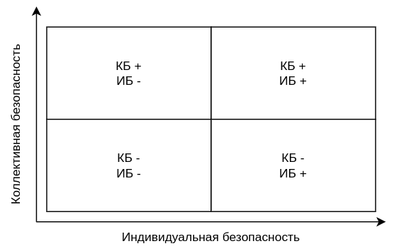

# Глава 3. Менеджер и команда

## Знакомство с командой

Итак, мы разобрались, что команды — сложные нелинейные системы, которые могут реагировать на управленческие воздействия порой непредсказуемо, что способы взаимодействия у людей тоже не всегда рациональны и обусловлены эволюцией нашего вида. Поэтому механистический подход к управлению командами работает плохо, и необходимо искать другие методы управления командами.

Чтобы подступиться к задаче давайте сначала выделим тот случай, когда руководителю достается "в наследство" уже сложившаяся команда, т.к. создание команды с нуля — более комплексная задача. Также ограничим пока численость до 15-20 человек (с масштабированием разберемся в последующих главах).

Очевидно, что первым шагом является сбор информации о том, как команда устроена. Не стоит сходу начинать вводить свои правила и порядки, потому что это приведет только к ответной реакции — команда закроет перед ним все двери и будет просто реагировать на вас как на внешнего агента, т.е. вырабатывать адаптации. Возможен вариант, когда команда наоборот ждет активного лидера, который подхватит упавший флаг, но такое бывает только когда командный дух уже подорван и система уже на грани распада.

Пока команда к вам присматривается важно прочитать её ключевые характеристики, чтобы более осмысленно выстраивать отношения. Я обычно для этого использую встречи один-на-один. Такие встречи в большинстве случаев воспринимаются доброжелательно, т.к. для кажого сотрудника это возможность познакомиться, высказаться и выяснить, что ожидает команду и его самого с приходом нового руководителя. И здесь следует задавать правильные вопросы и открыто транслировать свои ценности.

Обычно я начинаю с рассказа о себе, как я вижу свою задачу, с которой я прихожу в команду. Далее прошу рассказать о себе, чем человек занимается в команде, что нравится и не нравится. Личные вопросы тоже можно задавать. Например, можно спросить о детях, интересах и хобби. Всю собранную информацию я обычно фиксирую в своей базе знаний.

После личного знакомства можно переходить к вопросам о команде и первое, что стоит выяснить, действительно ли вы имеете дело с командой. Ключевым индикатором здесь является наличие одинаково понимаемой цели, поэтому я прошу сформулировать цель одной-двумя фразами и высказать свое мнение, одинаково ли эту цель понимают другие, как часто руководители озвучивают цель в явном виде и не противоречат ли сами себе. Ответы я тоже фиксирую для последующего анализа, и уже здесь обычно получается собрать много полезных сведений.

Следующий блок вопросов посвящен системным свойствам, которые должна проявлять команда: устойчивость, адаптивность и самоорганизация.

Устойчивость проявляется в:

- Желании людей работать вместе (даже если придется сменить цель, проект или организация).
- Не желании бросать коллег, даже если трудно.
- Поддержании контактов с теми, кто ушел.
- Наличии барьера для принятия новых членов (команда участвует в принятии решений о приеме новых коллег, возможно, есть ритуал посвящения).

Адаптивность проявляется следующим образом:

- При возникновении повышенной рабочей нагрузки (например, в связи с чьей-либо болезнью или сезонностью) люди самостоятельно переходят в усиленный режим работы.
- Члены команды при необходимости берут на себя обязанности друг друга.
- При возникновении проблем члены команды совместно вырабатывают подход к их решению.
- При необходимости в команде меняется лидер на того, кто обладает необходимыми компетенциями и опытом (смена доминирования).

Способность к самоорганизации выражается в следующем поведении:

- Команда способна выделить функцию для решения вновь появившейся регулярной задачи. Например, потребовалось делать регулярный отчет, который затрагивает всех, но кто-то один вызывается делать этот отчет за всех, чтобы сэкономить остальным время (и повысить свой социальный статус).
- Команда способна самостоятельно перераспределять роли и зоны ответственности.
- Команда способна менять лидера в зависимости от стоящих задач.

Необязательно команда будет проявлять все перечисленные свойства, но хотя бы 2-3 из них должны упоминаться в ответах большинства опрашиваемых.

Список возможных вопросов вы можете найти в приложении вместе с рекомендациями по обработке ответов. Можно задавать их выборочно, но можно и предложить их команде и в виде опросника. То, с какой охотой опросник будет заполняться — тоже показатель, но важно объяснить, зачем он нужен и какую пользу он принесет команде. Имейте ввиду, что если у вас не получится на личных встречах расположить к себе и завоевать доверие команды, то вашу просьбу заполнить анкету могут и проигнорировать. Действуйте здесь по ситуации, полагаясь на свой эмоциональный интеллект.

Если команда большая, то поговорить со всеми вам не хватит времени (именно поэтому я сразу оговорился, что такой подход сработает только на небольшой команде). Поэтому в таком случае стоит начать с бесед с лидерами подкоманд, и дальше уже работать с их подчиненными по мере возможностей и необходимости.  

# Стратегии управления командой

Классический директивный способ управления подразумевает, что руководитель сам принимает все решения, дает задания и контролирует их управление. Как мы уже разобрались, управлять командой директивным способом не очень эффективно, т.к. командам свойственен высокий уровень автономности. Нередко команда сама делегирует принятие решений тому, что лучше разбирается в вопросе.

Поэтому руководителю стоит подходить к управлению командой совершенно на другом уровне, и здесь можно выделить три основных способа, которые работают только в комплексе:

1. Управление целью и ценностями

2. Воздействие на внутренний консенсус

3. Воздействие на внешнюю среду

Разберемся, как это работает.

# Цель и ценности

Управление целью позволяет менять системообразющий фактор, который определяет состав и структуру команды, то о чем думают и к чему стремятся члены команды.

Цель должна быть значимой для всех, давать возможность каждому участнику проявить себя и получить удовлетворение от ее достижения. Хорошо, когда в цели содержится вызов, но она должна быть принципиально достижимой, т.к. нереальная цель может демотивировать.

Цель стоит обсуждать с командой, она же может стать отправной точкой для планирования конкретных усилий команды, задач, вопросов, которые необходимо исследовать, необходимых компетенций. Время от времени к цели стоит возвращаться, обсуждать прогресс, сложности и преграды, и намечать пути решения.

Систему мотивации тоже стоит привязывать к прогрессу достижения цели, причем в случае с командами ни в коем случае не стоит привязывать KPI к метрикам, которые различаются в зависимости от специализации. Это почти всегда приводит к тому, что все стремятся улучшать свои метрики даже в ущерб общему результату. Коллективная же ответственность за результат очень способствует командной работе: если у кого-то из членов команды что-то не получается или он не успевает выполнять свои задачи, то остальные стараются ему помочь и даже берут на себя выполнение его задач. Я сам так поступаю, и мне отвечают взаимностью, когда видят, что меня завалило административными задачами.  

Еще важно не путать цель и ценности. Ценность, это то, что в коллективе ценится, считается полезным и хорошим. Например, поиск решений может быть целью только у команд, которые специализируются на поиске решений, а *совместный* поиск решений может быть ценностью, т.к. все в команде считают, что это хорошо, помогает достигать общей цели и приносит удовлетворение. Ценность это про то, как вы будете достигать цель.

Поделюсь некоторыми ценностями, которые сам стараюсь транслировать командам:

| Ценность                         | Почему она работает                                                                                                                                                                                                                                                                   |
| -------------------------------- | ------------------------------------------------------------------------------------------------------------------------------------------------------------------------------------------------------------------------------------------------------------------------------------- |
| Люди                             | Людям всегда нравится, когда их ценят и заботятся об их комфорте, развитии и достатке. Кроме того, людям важно чувствовать, что лидер будет их защищать, даже если они ошибутся. Данная ценность хорошо влияет на ощущение безопасности, сплоченность, доброжелательность к новичкам. |
| Интересные и значимые задачи     | Задачи не должны быть никому ненужной формальной тратой времени. Люди любят чувствовать, что результат их труда востребован и полезен. Кроме того, эта ценность как бы кодтверждает, что эффективность на пути достижения цели важнее формальностей, KPI и отчетов.                   |
| Нестандартные и красивые решения | Данная ценность поощряет поиск новых способов решения поставленных задач, что нередко позволяет достичь цель быстрее и эффективнее. Когда такие решения удается реализовать, люди испытывают особое удовлетворение от результата.                                                     |

Закреплению ценностей в образе поведения команды очень помогают культурные отсылки или мемы. Например, цитата из мультсериала "Рик и Морти" может быть ироничным приглашением к эксперименту или поиску нестандартного решения: "Приключение на 20 минут! Зашли и вышли!". И конечно, ценности необходимо подтверждать личным примером.

# Управление изнутри

## Как стать "своим"

Для воздействия на внутренний консенсус необходимо стать частью команды, т.к. без этого команда будет воспринимать менеджера как "внешнего агента" и вырабатывать на его управленческие воздействия адаптивные реакции.

И на пути интеграции в команду очень помогают культурные идентификаторы: например, разумное использование профессионального сленга и характерных шуток, а также внешний вид. В ИТ с этим всё просто, т.к. данная область характерна не только развитым сленгом, но и имеет собственную субкультуру, отражающуюся в постоянно возникающих мемах и культурных отсылках. Не стоит одеваться как топ-менеджер, приходя в такую команду. Лучший выбор: джинсы, кроссовки, футболка (отлично, если на ней какой-нибудь прикольный принт).

Также стоит подмечать нюансы во внешнем виде членов команды, которыми они подчеркивают свою идентичность. Например, это может быть преобладающий цвет одежды, тематика принтов на футболках, значки в петлицах пиджаков, пряжки ремней и т.п. Если какого-то общего идентификатора нет, то можно поддержать какой-нибудь отдельный.

> **Пример из практики**
> 
> В команде не было никаких внешних идентификаторов, но один из сотрудников по пятницам, когда в компании была свободная форма одежды, регулярно приходил на работу в футболках на космическую тематику. Т.к. тоже люблю космос, астрономию и всё с этим связанное, я стал по пятницам выбирать такую же тематику принтов: портрет Гагарина, фото Юпитера с межпланетной станции Juno и т.п. Вдруг тему поддержал еще кто-то, и постепенно это стало традицией. Причем иногда это были очень забавные принты типа мультяшного Картмана в скафандре. В ходу были и другие элементы одежды типа кед с логотипом NASA.

Не стоит забывать и про культурные зацепки типа цитат из книг, фильмов и сериалов. В среде технарей популярны классическая фантастика и фентези, или просто хорошее кино с высокой цитируемостью типа фильмов Тарантино, Гая Ричи или даже Марка Захарова. Но стоит учитывать средний возраст в команде — в среде 20-25-летних ребят шутку с цитатой из "Бойцовского клуба", скорее всего, просто не поймут.

Ну, и, конечно, самый действенный способ стать своим — показать, что тоже можешь что-то "делать руками".

> **Пример**
> 
> Лет 10 назад карьерный путь завел меня в банк на позицию руководителя отдела развития банковских продуктов. Тогда еще продуктовый подход (при котором продакт-менеджеры являются частью технической команды) не сформировался, поэтому для подразделения ИТ я был очередным "бизнесоидом", который своими "гениальными" идеями только создает лишнюю головную боль. Я, конечно, пытался установить контакт с технарями, т.к. от их вовлечённости напрямую зависел мой результат, но они не были ко мне расположены. Когда я заходил к ним в гости, они меня "терпели", не особо это скрывая. И вот однажды во время очередного такого общения с техническим директором тот меня подвел к одному из программистов, чтобы кое-что уточнить. Программист в этот момент отлаживал хранимую процедуру на PL SQL, а тут мы его пришли отвлекать. Конечно, нельзя сказать, что он был этому рад, потому что процедура явно не хотела выполняться из-за ошибки. Сидя в пол оборота, программист нехотя общался со мной, делал правки в коде, запускал его, и на его экране снова и снова отображалось сообщение об ошибке.

> И вдруг я наклонился чуть ближе к монитору и говорю вполголоса: "Смотри, у тебя вот здесь не хватает запятой, и вот тут скобка не закрыта". Программист одарил меня недоверчивым взглядом, но быстро внес предложенные мной исправления, и код выполнился. Короткие проверки, и ответ "Хм, точно. Да, все верно отработало". И всё изменилось!

> Поверх мониторов на меня смотрело несколько пар глаз с выражением смешанного удивления и уважения. С этого момента в Департамент ИТ я заходил как домой: меня приветствовали как своего, печеньки принимались благосклонно, и объяснять, что нужно сделать, стало намного проще. Сам я по образованию — программист с большим опытом в разработке ПО, и ребята быстро оценили мою способность хорошо сформулировать задачу на техническом языке, стали меня воспринимать как "своего" в коммерческом департаменте.

Поэтому очень важно быть компетентным не только в менеджменте, но и в предметной области, в которой работает команда. И демонстрация своих компетенций будет играть вам на руку. Правда, свои компетенции лучше проявлять не напрямую.

Один из моих излюбленных инструментов — участие в технических собеседованиях, где есть возможность задавать кандидатам специфические вопросы из предметной области, и эти вопросы будут слышать не только кандидаты, но и ваши сотрудники. Кроме того, рассказывая о компании кандидату, у вас есть возможность транслировать коллегам свое видение и планы развития. Часто менеджеры в связи с занятостью участвуют только в финальных собеседованиях с уже прошедшими предварительный отбор кандидатами, на встрече с которыми присутствует только менеджер по подбору персонала, и таким образом упускают эту замечательную возможность.

Если в подразделении есть культура внутреннего обучения, то стоит проводить и мастер-классы. Потратив всего несколько часов на подготовку, можно выиграть признание, которое другими способами заработать крайне сложно. Если с вами начали советоваться, то это хороший знак.

## Ритуалы доверия

Как я уже писал, ритуалы играют огромную роль в установлении отношений между людьми и проявлении групповой идентичности, и это обусловлено нашим эволюционным путем развития как вида. К сожалению, здесь приходится собирать информацию по крупицам, просеивая множество статей с плохим качеством исследований. По большому счету, есть лишь разрозненные кейсы и достаточно обширный опыт применения "ритуалов" в командах, работающих по agile-практикам, и этот опыт показывает, что повторяемые ритуальные действия — это хорошо. 

Тем не менее, стоит выделить два вида ритуалов, которые могут быть полезны менеджеру в процессе интеграции в команду — это ритуалы доверия.

1. **Доверие через пищу**
   Самый очевидный способ подтвердить доверительные отношения — разделить трапезу. По сути ритуал совместного приема пищи — это древний сигнал "мы с тобой не конкурируем, наши ресурсы общие", который работает даже у животных. Именно поэтому данный ритуал имеет широкое распространение в самых разных культурах: накормить гостя считается обязательным, т.к. это позволяет гарантировать свою собственную безопасность; да и само застолье всегда имела объединяющую функцию в любом обществе. Совместный заказ обеда или походы к кофе-машине работают аналогично, если эти действия становятся повторяемыми ритуалами.
   Но есть нюансы. Например, попытка заплатить за обед коллеги может быть воспринята как символическое указание своей доминирующей позиции. Это не всегда хорошо в командах, т.к. может спровоцировать конкуренцию и формирование коалиции против вас (в качестве балансирующей силы). Кроме того, если данное действие будет принято, от вас будут ожидать активного лидерства, и гораздо проще будет разочаровать тех, кто согласился с вашей лидерской позицией.

2. **Доверие через уязвимость**
   В книге "Культурный код. Секреты чрезвычайно успешных групп и организаций" Дэниэла Койла целая глава посвящена кейсам про то, как важно делиться уязвимостью для выстраивания доверительных отношений. Идея основана на исследованиях доктора Джеффри Ползера из Гарвардской бизнес-школы, который утверждает, что обмен уязвимостью на 24% увеличивает вероятность возникновения доверия. Честно сказать, не валидировал данное исследование, т.к. не нашел его в открытом доступе, но в целом механизм рабочий.

В общем виде процесс обмена уязвимостью выглядит следующим образом:

- Первый участник коммуникации посылает сигнал о своей уязвимости (например, признается, что чего-то не знает, просит помощи, делится переживаниями).
- Второй участник распознает этот сигнал и отправяет ответный сигнал о своей уязвимости.
- В результате между людьми устанавливается доверие, которое делает ненужными излишнюю осторожность, и коммуникации становится более эффективными.

У животных существует аналогичный ритуал установления доверительных отношений, и для этого, например, кошки дают погладить живот как самое уязвимое место. Таким образом, они как бы говорят "я не конкурирую с тобой, мы друг другу не чужие" и "я тебе доверяю". Вероятно, какая-то древняя часть нашего мозга именно так интерпретирует подобное поведение, хоть и выраженное в более сложной форме.

Но применять этот механизм нужно правильно. Во-первых, рекомендую посылать сигнал о собственной уязвимости первым. Лидеру это дает возможность проанализировать реакцию того, кому он адресован, потому что именно от получателя зависит, сработает механизм или нет. Посылая сигнал уязвимости, лидер устанавливает допустимый формат и уровень доверия. Во-вторых, важно не пропустить и корректно ответить на сигналы уязвимости, исходящие от подчиненных.

Если лидер в ответ не реагирует или наоборот показывает, что он не имеет слабостей, то это наоборот может усилить недоверие, и потом растопить лед будет гораздо сложнее. Так что предлагая эту “игру” первым, будьте готовы к ответу и не пропустите "ответный пас". Ну, и конечно, стоит ценить подобные проявления от подчиненных: если с вами делятся личными сложностями или беспокойствами, то поддержите и ответьте тем же.

Установление доверия через описанные ритуалы очень помогает стать своим и получить возможность влиять на внутренний консенсус внутри команды. 

## Управление консенсусом

Как мы уже разобрались, директивный стиль управления, когда лидер единолично принимает решение, даже советуясь с командой, работает плохо. Он не очень соответствует самой природе команды.

Часто команды неплохо сами принимают решения через консенсус или смену доминирования, поэтому я бы сказал, что роль руководителя здесь заключается не столько в принятии решений за команду, сколько в обеспечении самого процесса принятия решений. Иными словами, приходя в команду, лидеру стоит подумать над тем, как помочь команде принимать решения быстрее и по возможности так, чтобы все были согласны. Консенсус не означает стопроцентное согласие, но команде гораздо проще консолидировать усилия и действовать без лишних промедлений, когда большинство согласно.

Обычно в процессе знакомства я предлагаю команде принять какое-нибудь решение (например, организовать поход в бар) и сначала наблюдаю, что происходит: кто и как пытается предложить варианты, как идет обсуждение и как финализируется решение. Это же позволяет выявить лидеров, которые не только предлагают, но берут на себя организационные вопросы, а также подметить сложности, которые испытывает команда.

Чаще всего, по опыту, командам не хватает регулярности совместных обсуждений и навыка фиксирования результатов обсуждений. Поэтому хорошей практикой на начальном этапе является организация регулярных командных встреч для обсуждения насущных вопросов, планов и путей решений стоящих перед командой задач. Не забывайте фиксировать договоренности в виде электронных писем или записей в блоге. Это требует определенных усилий и дисциплины со стороны руководителя, но повышает общую осведомленность о происходящем в проекте или процессах, формирует хорошие привычки у команды в плане структурирования коммуникаций. Помните, что команды стремятся не делать бесполезные усилия, но если структурирование коммуникаций действительно будет всем помогать, то скоро это станет естественным процессом.

Конечно, в зависимости от интенсивности работы, и частота встреч должна меняться. Не стесняйтесь, спрашивать у членов команды, нужна ли очередная встреча. Если вы будете быстро завершать планерки, в которых нет необходимости, то команда будет вам только благодарна, потому что это сэкономит всем время. Но себе поблажек не давайте и все равно фиксируйте результаты. Если кто-то предложит сделать это за вас, то это означает, что команда приняла эту необходимость и в то же время ценит ваши усилия и время.

## Смена доминирования

Смена доминирования — это еще один интересный социальный механизм, который заключается в том, что команда делегирует принятие решения тому, кто обладает необходимыми для этого компетенциями. Иногда такой способ принятия решений оказывается намного эффективнее совместного поиска консенсуса.

Чтобы его запустить, важно выявить тех, кому действительно хватает компетенций для нужных команде решений. Это могут быть разные люди в разных ситуациях, но им может не хватать уверенности в себе, чтобы брать на себя ответственность. И здесь задача руководителя заключается в том, чтобы помочь начать брать на себя ответственность.

Важно помнить, что ответственность не делегируется, т.е. вы как руководитель несете всю ответственность за принятые своими подчиненными решения. Поэтому важно показать, что вы доверяете специалисту и не скидываете на него груз ответственности, а будете нести ответственность за возможные ошибки даже большую, чем он, но доверяете его знаниям и опыту. Начинать можно с небольших и не очень критичных решений, совместно разбирать ошибки, поддерживать и подключать общественное поощрение, помогать презентовать команде принятиые решения, разъясняя их ценность. Экономия времени и усилий всегда будет цениться и вызывать благодарность по отношению к тому, кто принял хорошее решение.

Вы можете считать, что достигли успеха, когда специалисты начнут приходить к вам с готовыми вариантами решений, подкрепленными анализом их преимуществ и недостатков. В этом случае давайте возможность им самим выбрать оптимальный вариант и поддержите это решение, не присваивая его себе. Именно такое поведение руководителя полностью соответствует принципам командной работы. И, поверьте, вам будут благодарны за это.

# Управление внешней средой

Любая система находится в некотором окружении, которое может воздействовать на нее, создавая ограничения и возможности. Таким образом изменяя эту внешнюю среду можно воздействовать и на систему.

Представим микроорганизм, который в процессе своей эволюции выработал чувствительность к освещению. Если света становится меньше, то он оказывается в зоне дискомфорта и начинает хаотично двигаться, пытаясь найти более светлое место. Такое поведение закрепил естественный отбор — выжили только те, кто стремился оказаться в более освещенном месте. Чтобы заставить этот микроорганизм двигаться в нужном направлении, нужно затемнить те направления, которые нам не нужны, и подсветить целевое направление. Думаю, общая идея ясна.

Гомеостаз открытой системы (частным случаем которой является команда) достигается когда сбалансированы внутренние и внешние силы. Команда находится в зоне комфорта, она функционирует привычным ей образом, экономя при этом свою энергию. И вывести ее из равновесия прямым воздействием очень трудно. Но представим, что какое-то привычное для нее действие становится более энергозатратным. Это запустит процесс поиска другого более энергетически эффективного способа решения задачи. 

> **Пример**
> 
> Прийдя в уже сложившуюся команду, я заметил, что все сидят на своих местах за компьютерами, а культуры совместного поиска решений нет. Стандартные планерки вызывают раздражение, т.к. они отвлекают. Это приводит к плохой осведомленности о том, что делают другие, хотя общую цель все понимают одинаково. Вроде бы и команда есть, но коммуникаций явно не хватает, имплементировать сложный процесс, требующий коллективной работы, не представляется возможным.
> 
> Чтобы исправить ситуацию, я начал издалека. Сначала организовал место, где можно было попить кофе или чай, согласовал бюджет на закупку печенек. Затем сформулировал несколько задач, которые требовали участия нескольких человек и начал демонстративно обсуждать эти задачи за чашечкой кофе с печеньками и шутками-прибаутками. Процесс получался довольно веселым и интересным, и главное эффективным. Так я зажег фонарик, обозначив ту норму поведения, которую мне хотелось бы внедрить. Народ начал иногда присоединяться просто чтобы послушать и поболтать, подкидывая свои идеи. Но осталось несколько сотрудников, которые упорно не хотели вставать из-за компьютеров и присоединиться.
> 
> А теперь ход конем: тем, кто не принял такой способ взаимодействия, я поставил задачи, которые невозможно было решить в одиночку. Таким образом я поставил их в неудобное положение при том, что простой путь был очевиден: либо сидишь на своем месте и страдаешь над решением задачи, либо довольно весело и непринужденно ищешь решение совместно с коллегами.

В данном случае, я не изменял окружение команды для изменения принятых норм поведения и не корректировал внешние воздействия. Единственный привлеченный ресурс — бюджет на чай и печенье. Но руководителя есть преимущество: он может фильтровать ненужные воздействия внешней среды или наоборот пропускать те, которые могут повлиять на груповую динамику и сдвинуть систему в нужном направлении.

## Информация и ресурсы

Команды как частный случай открытых систем характеризуются постоянным обменом информацией, ресурсами и энергией с внешней средой. Этот обмен оказывает существенное влияние на внутреннюю структуру и функционирование системы.

Если команда действует в условиях недостатка информации, то ей придется как-то справляться с неопределенностью. Например, команда может начать больше ресурсов на "внешнюю разведку" или закладывать в своей деятельности запас прочности на случай непредвиденных ситуаций. Поэтому одной из важнейших задач руководителя является информирование, чтобы команда лучше понимала, что происходит вокруг нее. Собирайте, классифицируйте, фильтруйте и доводите информацию до команды на регулярной основе. Это снизит напряжение из-за неопределенности и сэкономит энергию и нервы.

Доступ же к ресурсам определяет возможности системы. Например, недостаток ресурсов может ограничивать производство, а избыток — стимулировать расширение и инновации. Но избыток ресурсов может также приводить к тому, что команда будет вынуждена тратить энергию и время на управление излишними складскими запасами, или защищать эти излишки от других. И здесь руководителю стоит обращать внимание на то, каких ресурсов не хватает, а какие есть в излишке. Лишнее можно использовать как валюту для обмена ресурсами с другими командами.

Даже элементарная нехватка розеток на рабочем месте может бесить и отнимать энергию, но решается это с помощью сетевого фильтра или простого удлинителя, который можно выменять, или даже просто купить за свои деньги. Я уже не говорю об удобных стульях, компьютерной переферии, кулере и других офисных мелочах. Когда вы обеспечите своему сотруднику эту мелочь, упростив ему жизнь, без какого-либо запроса, просто потому что подметили, что человек мучается, поверьте, на вас будут смотреть совсем другими глазами. Так что если в компании с заботой о комфорте сотрудников дела обстоят не очень хорошо, воспринимайте это как возможность чаще заботиться о своих людях.

Хорошие отношения с другими командами или владельцами ресурсов тоже очень сильно упрощают жизнь. Здесь стоит вести системную работу по установлению и поддержанию таких контактов. Помогайте другим командам, и потом вам будет намного проще добыть то, что будет необходимо для вашей команды.

Таким образом управление информационными потоками и доступными ресурсами является очень важной задачей руководителя, а системная работа в этом направлении дает возможность влиять на то, как функционирует команда, завоёвывать доверие и уважение.

## Стейкхолдеры и управление ожиданиями

Стейкхолдеры — это люди, которые так или иначе заинтересованы в результатах работы команды. В стремлении добиться нужного результата они нередко напрямую вмешиваются в работу команды, оказывают давление и даже пытаются манипулировать. Чаще всего это связано с непониманием того, как можно добиться разультата другими способами, ведь со стороны может казаться, что команда живет своей жизнью и как будто не очень беспокоится о том, что, по мнению стейкхолдера, она должна делать.

Действительно цель команды может не соответствовать ожиданиям стейкхолдера, поэтому руководителю сразу стоит выявить ожидания людей, которые каким-либо образом могут или хотят влиять на команду и проанализировать, насколько эти ожидания непротиворечивы и соответствуют цели команды.

Если кратко, то алгоритм приблизительно следующий:

1. Выявить стейкхолдеров, установить с ними контакт;

2. Постараться выяснить их интересы, определить степень влияния и ресурсы, которые могут быть получены с их помощью;

3. Наладить регулярную коммуникацию, правильно расставляя приоритеты, чтобы не было лишнего напряжения из-за неопределенности, а также мониторить возможные риски.

В целом подходы к управлению взаимодействию со стейкхолдерами известны давно. Основные артефакты:

- Реестр стейкхолдеров с указанием их интересов, частоты взаимодействий, влияния и рисков

- Матрица влияния и интереса, для выявления ключевых партнеров

- Матрица RACI

- План коммуникаций со стейкхолдерами

Более подробные инструкции и шаблоны артефактов можно найти в интернете. Рекомендую пользоваться, т.к. внешняя среда — это зона ответственности лидера команды. Набравшись опыта вы сможете не только взаимодействовать со стейкхолдерами и управлять рисками, которые от них могут исходить, но и влиять на ожидания стейкхолдеров, влияя на постановку задач на ранних этапах, выигрывая для команды дополнительное время и ресурсы.

## Управление безопасностью

Безопасность — это базовая функция любого социального объединения и команды в частности. Поэтому очень важно грамотно управлять безопасностью — именно этого обычно ждут от нового руководителя, в особенности если команда переживает не лучшие времена.

Если за базис взять индивидуальную (ИБ) и коллективную безопасность (КБ), то у нас получится такая матрица:

Разберем частные случаи

1. **ИБ+ КБ+** 
   Все чувствуют индивидуальную и коллективную безопасность. Есть возможность для творчества, развития и инноваций. Это нормальный режим работы сообщества или команды, в котором мы получаем максимальный синергетический эффект, и к которому мы стремимся.
   Из недостатков: относительная свобода приводит к тому, что в социальной системе могут появиться желающие пользоваться преференциями, имитируя свой вклад (по сути, это стратегия паразита). Спустя какое-то время система начинает стремиться сохранить свою устойчивость за счет внедрения регламентов и соглашений, что в итоге может привести к стагнации и деградации.
   Что делать менеджеру: работать над авторитетом команды во-вне, делиться признанием со всеми членами команды, не давать команде стагнировать, регулярно ставить команду перед новыми вызовами.

2. **ИБ- КБ+**
   В целом группе ничего не угрожает, но люди не чувствют себя в безопасности. Например: отдел на хорошем счету в компании, щелкает задачи как орешки, а менеджер - всегда молодец, но достигается это за счет ночных переработок, WhatsApp-менеджмента и принесения в жертву тех, кто совершил ошибку.
   Такое состояние приводит к регулярному возникновению изгоев, которые либо противостоят системе (и она их в конечном итоге перемалывает), либо к их уходу, т.е. характерна высокая текучесть кадров.
   Таким образом, команда не выполняет своей защитной функции, и чаще всего это лишь имитация команды, т.к. цели группы и ее членов не синхронизированы, а люди используются как ресурс. Обычно в таких коллективах возникает "приближенная элита", которая получает дополнительные преференции. А еще менеджеры таких "команд" иногда намеренно загоняют людей в аврал, устраивают мозговые штурмы после завершения рабочего дня или проводят рабочие встречи на выходных - по их мнению, это позволяет отсеить "неправильных" и нелояльных.
   Новому менеджеру стоит понимать, что он имеет дело с коллективом, которому, скорее всего, чужд командный (или, если угодно, "бирюзовый") подход.

3. **ИБ+ КБ-**
   Люди воспринимают команду как инструмент для обеспечения своей персональной безопасности. Обычно такие условия возникают в командах, находящихся в агрессивном окружении.
   Это может быть выражено, например, в несоответствии ценностей команды и того, как работает вся остальная организация. В результате, команда оказывается под постоянным давлением, вынуждена бороться с бюрократией и политическими играми.
   В таких командах большое значение играют ритуалы и личные отношения, очень выражены социальные идентификаторы. Коллеги готовы жертвовать своим свободным временем, брать на себя сложные задачи и прикрывать друг друга, действовать в интересах коллектива. Есть ответный негатив во внешнее окружение.
   В целом такая разбалансировка индивидуальных и групповых интересов может выдавать высокую эффективность, но нужно помнить, что в таких условиях люди со временем устают ставить общественные интересы выше своих и чаще выгорают. Такая команда может существовать достаточно долго только за счет постянного притока новых людей или объединения против "внешнего врага".

4. **ИБ- КБ-**
   Терминальная стадия существования команды, сопровождающаяся разочарованием и переоценкой ценностей. Спасать команду в этом состоянии очень сложно, а занятие это неблагодарное. Можно попытаться дать людям новые смыслы, идентификаторы, но по возможности лучше дистанцироваться от символов разрушившейся социальной системы.

Конечно, сегодня нам не нужно отбиваться от саблезубых тигров и бегать за мамонтами как приходилось нашим предкам на протяжении тысяч лет. Современные угрозы носят другой характер: неопределенность, бардак и негативный эмоциональный фон.

Конечно, нужно стремиться, чтобы все члены команды чувствовали безопасность как индивидуальную, так и коллективную — это необходимо для нормально совместной работы. Порассуждаем, что здесь стоит делать руководителю:

1. Всячески пресекать нападки на команду в целом, фильтровать негатив в сторону команды, а позитив наоборот подчеркивать, хвалить, когда команда смогла совместными усилиями отстоять свою позицию.

2. Отлеживать ситуации, когда кто-то начинает чувствовать себя в команде некомфортно или, или не дай бог, изгоем, и вовлекать таких людей в совместную деятельность, транслировать им мысль, что быть частью команды безопаснее, потому что всегда можно получить помощь и поддержку.

3. Поощрять взаимную поддержку и защиту, например, подключая членов команды к сложным переговорам или взаимодействиям с внешними контрагентами или стейкхолдерами.

[← Предыдущая глава](02.chapter2.md) | [Оглавление](README.md) | [Следующая глава →](04.chapter4.md)
