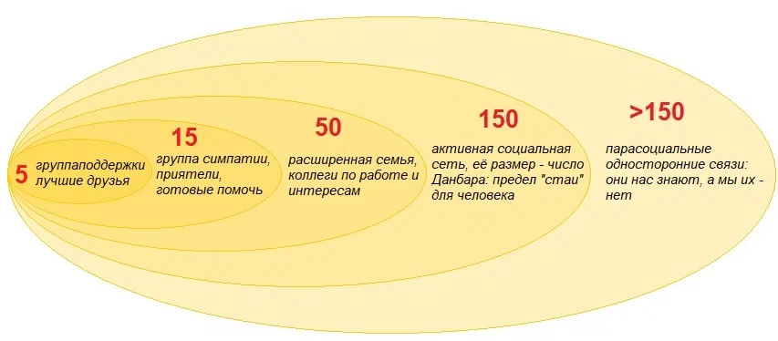

# Глава 4. Модель зрелости команд

## Кризисы роста команд

Но частотой взаимодействий все не ограничивается. Как я уже писал, мы стараемся отслеживать не только свои контакты, но и то, как другие общаются между собой. И мы используем для этого отдельную нейросеть в мозге  — сеть пассивного режима работы мозга (СПРРМ). Таким образом, чем больше команда, тем больше времени требуется для обработки такой информации, и мы предпочитаем ограничивать прямые контакты, т.к. одновременно с работой СПРРМ мы не можем думать. А если мы оказываемся в конкурентной среде с большим количеством «подковерных интриг», то для нас гораздо важнее оценивать социальные угрозы, и ресурса мозга на продуктивную работу может не хватить.

Дальнейшее развитие данной идее нашло отражение в модели социального окружения Данбара:

Далее по мере увеличения численности команды происходит еще большая кластеризация (разделение на сплоченные подгруппы) и приблизительно на численности 35-40 человек наступает кризис. Максимальная численность групп в детских садах, классов в школах, взводов в самых разных армиях мира обусловлена именно этим пределом.

## Маркеры

## Матрица зрелости

## Факторы модели

## Методика аудита

[← Предыдущая глава](03.chapter3.md) | [Оглавление](README.md) | [Следующая глава →](05.chapter5.md)