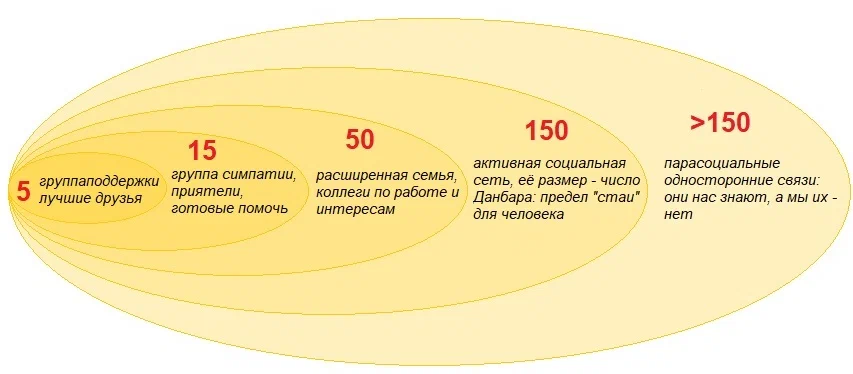

# Глава 4. Модель зрелости команд

- По мере роста численности команда переживает последовательность кризисов коммуникаций, связанных необходимой высокой частотой взаимодействий, и для их преодоления необходмы качественные изменения в структуре этих коммуникаций, а также имплементация механизмов 

- Эти кризисы объективны

## Кризисы роста команд

Но частотой взаимодействий все не ограничивается. Как я уже писал, мы стараемся отслеживать не только свои контакты, но и то, как другие общаются между собой. И мы используем для этого отдельную нейросеть в мозге  — сеть пассивного режима работы мозга (СПРРМ). Таким образом, чем больше команда, тем больше времени требуется для обработки такой информации, и мы предпочитаем ограничивать прямые контакты, т.к. одновременно с работой СПРРМ мы не можем думать. А если мы оказываемся в конкурентной среде с большим количеством «подковерных интриг», то для нас гораздо важнее оценивать социальные угрозы, и ресурса мозга на продуктивную работу может не хватить.

Дальнейшее развитие данной идее нашло отражение в модели социального окружения Данбара:

Далее по мере увеличения численности команды происходит еще большая кластеризация (разделение на сплоченные подгруппы) и приблизительно на численности 35-40 человек наступает кризис. Максимальная численность групп в детских садах, классов в школах, взводов в самых разных армиях мира обусловлена именно этим пределом.

## Маркеры

### Безопасность

О степени внешней безопасности можно также судить по склонности к иерархичности. Формальных исследований влияния внешних угроз на иерархичность социальных систем я, к сожалению, не нашел. Но нидерландский исследователь приматов Франс Де Вааль в своей книге "Наша внутренняя обезьяна. Двойственная природа человека" обратил внимание, что: "субординация побеждает демократию всякий раз, когда требуются решительные действия. Мы спонтанно переключаемся в более иерархический режим в зависимости от обстоятельств" [9].

Временная концентрация власти в одних руках в случаях крайней необходимости действиельно работает. Например, в Древнем Риме существовала практика временного назначения Диктатора, т.е. черезвычайно уполномоченного должностного лица, при военной опасности или внутренних волнениях, которые грозили Республике. Остальные должностные лица автоматически становились его подчиненными и обязаны были выполнять его приказы.

Иерархически упорядоченные армии нового времени много раз били феодальные армии, в которых иногда было сложно договориться, кто главный, а также отсутствовала унификация вооружения и централизованная система распределения довольствия. Так что в человеческой истории подтверждений этого тезиса предостаточно.

управляя безопасностью (уровнем стресса) можно воздействовать на чувство общности и иерархичность. И обратно, оценивая чувства причастности и иерархию можно оценить, насколько безопасной или агрессивной по отношению к себе команда воспринимает окружение. Т.е. это один из маркеров, подсказывающих менеджеру состояние команды.

## Матрица зрелости

## Факторы модели

## Методика аудита

[← Предыдущая глава](03.chapter3.md) | [Оглавление](README.md) | [Следующая глава →](05.chapter5.md)

---

Текст распространяется по лицензии <a href="https://creativecommons.org/licenses/by-nc-nd/4.0/?ref=chooser-v1" target="_blank" rel="license noopener noreferrer" style="display:inline-block;">CC BY-NC-ND 4.0</a> (копирование и создание производных произведений без указания авторства, а также коммерческое использование запрещены) 
